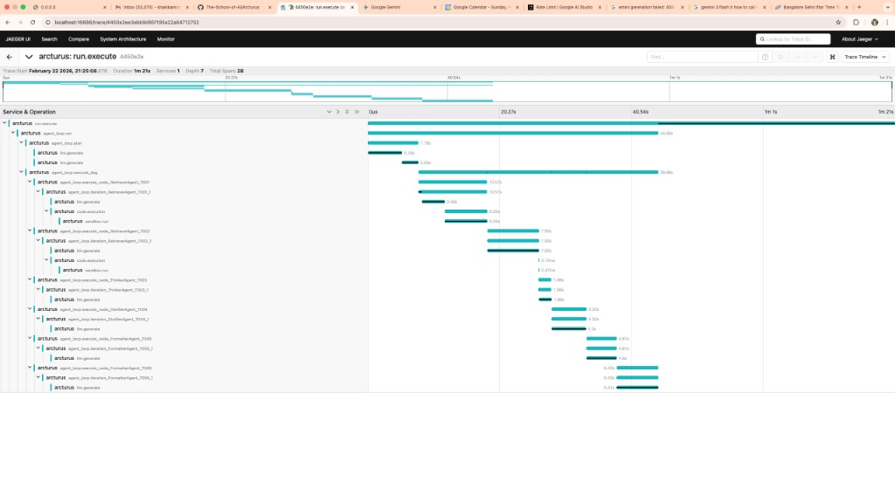

# P14 Watchtower — Delivery README

**Project:** P14 Watchtower — Admin, Observability & Operations Dashboard  
**Scope:** Days 1–15 — Tracing, Cost, Health Monitoring, Admin Controls  
**Branches:** p14_week1_kamran, p14_week3_kamran, main

---

## 1. Scope Delivered

### Phase 1 — Distributed Tracing (Days 1–5)

- **OpenTelemetry integration** — Spans exported to MongoDB and Jaeger (OTLP HTTP)
- **End-to-end run tracing** — User query → planner → agent DAG → tool calls → response
- **Span hierarchy** — `run_span` → `agent_loop_run_span` → `agent_plan_span` → `agent_execute_dag_span` → `agent_execute_node_span` → `agent_iteration_span` → `llm_span` / `code_execution_span` / `sandbox_run_span`
- **Resume support** — Traces linked by `run_id` and `session_id` for resumed runs
- **Admin API** — Query traces and metrics from MongoDB
- **Fallback UI** — HTML page at `/api/admin/traces/view` when Jaeger is not running

### Phase 2 — Cost Analytics & Error Tracking (Days 6–10)

- **Cost summary API** — `/admin/cost/summary` aggregates cost from spans by agent, model, or trace
- **Error summary API** — `/admin/errors/summary` aggregates error spans
- **Configurable cost calculator** — `ops/cost/ConfigurableCostCalculator` for per-model pricing

### Phase 3 — Health Monitoring (Days 6–10)

- **Health checks** — MongoDB, Qdrant, Ollama, MCP gateway, Neo4J
- **HealthScheduler** — Periodic background health checks with configurable interval
- **Health history** — `/admin/health/history` with MongoDB-backed `HealthRepository`
- **Uptime tracking** — `/admin/health/uptime` per-service uptime percentages
- **Resource monitoring** — `/admin/health/resources` for CPU, memory, disk
- **Alert evaluation** — Threshold-based alert system for health anomalies

### Phase 4 — Admin Controls (Days 11–15, Charter 14.4)

- **Feature flags** — JSON-file-backed `FeatureFlagStore` with global toggle, lifecycle-managed flags (voice_wake, health_scheduler) that stop/start background services
- **Cache management** — List known caches (settings, FAISS, MCP sessions) and flush settings cache
- **Config management** — View current config and diff against defaults
- **Diagnostics (`arcturus doctor`)** — Automated checks: Python version, env vars, config validity, FAISS index, disk space, plus all service health checks
- **Sessions** — List recent sessions from span data (session_id, cost, agents)
- **Throttle policy** — Global hourly/daily cost budgets with enforcement and admin override

### Frontend — Admin Dashboard

- **AdminDashboard.tsx** with 7 tabs: Traces, Cost, Errors, Health, Flags, Config, Diagnostics
- **FlagsPanel** — Toggle, add, delete feature flags with lifecycle badge
- **ConfigPanel** — Read-only config viewer with diff-from-defaults comparison
- **DiagnosticsPanel** — Run arcturus doctor on-demand, displays check results with suggestions + cost budget gauges

### Jaeger Trace Visualization



*Full trace of a run: `run.execute` → `agent_loop_run` → planner, DAG execution, agent iterations (RetrieverAgent, ThinkerAgent, ChatGenAgent, FormatterAgent), `lm.generate` and `code.execution` spans. Duration ~1m 21s, 28 spans, depth 7.*

---

## 2. Architecture Changes

| Component | Change |
|----------|--------|
| `ops/tracing/` | New package: `core.py` (MongoDB + Jaeger exporters), `spans.py` (decorators), `context.py` (span context), `helpers.py` (plan-graph attachment) |
| `ops/health/` | New package: health checks (MongoDB, Qdrant, Ollama, MCP, Neo4J), HealthScheduler, alert evaluation, HealthRepository |
| `ops/cost/` | ConfigurableCostCalculator for per-model pricing |
| `ops/admin/` | New package: `feature_flags.py` (FeatureFlagStore), `diagnostics.py` (arcturus doctor), `throttle.py` (ThrottlePolicy), `spans_repository.py` |
| `api.py` | Lifespan bootstrap: `init_tracing()` + FastAPIInstrumentor |
| `core/loop.py` | Instrumented with `run_span`, `agent_loop_run_span`, `agent_plan_span`, `agent_execute_dag_span`, `agent_execute_node_span`, `agent_iteration_span` |
| `core/model_manager.py` | `llm_span` around LLM calls |
| `core/sandbox/executor.py` | `sandbox_run_span` with security/execution error capture |
| `memory/context.py` | `code_execution_span` for code runs |
| `routers/admin.py` | Admin router: traces, cost, errors, health (history/uptime/resources), feature flags, cache, config, diagnostics, sessions, throttle |
| `routers/runs.py` | Wrapped with `run_span`; agent execution uses tracing spans |
| `routers/voice.py` | Feature flag guard for voice_wake |
| `config/feature_flags.json` | New: default feature flags (deep_research, voice_wake, multi_agent, cost_tracking, semantic_cache, health_scheduler) |
| `docker-compose.yml` | Added `mongodb` and `jaeger` services |
| `config/settings.json` | Added `watchtower` block: `enabled`, `mongodb_uri`, `jaeger_endpoint`, `throttle` |
| `platform-frontend/` | AdminDashboard.tsx + FlagsPanel, ConfigPanel, DiagnosticsPanel (added to existing TracesPanel, CostPanel, ErrorsPanel, HealthPanel) |

---

## 3. API And UI Changes

### Admin API (no auth — auth is a remaining gap)

| Endpoint | Method | Description |
|----------|--------|--------------|
| `/api/admin/traces` | GET | List traces (optional: `run_id`, `limit`, `since`) |
| `/api/admin/traces/{trace_id}` | GET | Full span tree for a trace |
| `/api/admin/traces/view` | GET | HTML fallback page with link to Jaeger UI |
| `/api/admin/metrics/summary` | GET | Aggregates: total traces, avg duration, error count |
| `/api/admin/cost/summary` | GET | Cost breakdown by agent, model, or trace |
| `/api/admin/errors/summary` | GET | Error span aggregation by agent/span name |
| `/api/admin/health` | GET | Current health status of all services |
| `/api/admin/health/history` | GET | Historical health snapshots (filterable by service, hours) |
| `/api/admin/health/uptime` | GET | Per-service uptime percentages |
| `/api/admin/health/resources` | GET | System resources: CPU, memory, disk |
| `/api/admin/flags` | GET | List all feature flags |
| `/api/admin/flags/{name}` | PUT | Toggle a feature flag (lifecycle flags stop/start services) |
| `/api/admin/flags/{name}` | DELETE | Delete a feature flag |
| `/api/admin/cache` | GET | List known caches with stats |
| `/api/admin/cache/{name}/flush` | POST | Flush a cache (currently: settings only) |
| `/api/admin/config` | GET | Return current live config |
| `/api/admin/config/diff` | GET | Diff between current settings and defaults |
| `/api/admin/diagnostics` | GET | Run arcturus doctor diagnostics |
| `/api/admin/sessions` | GET | List recent sessions from span data |
| `/api/admin/throttle` | GET | Current cost usage vs budgets |
| `/api/admin/throttle` | PUT | Update daily/hourly budget limits |

### Settings

```json
"watchtower": {
  "enabled": true,
  "mongodb_uri": "mongodb://localhost:27017",
  "jaeger_endpoint": "http://localhost:4318/v1/traces",
  "throttle": {
    "daily_budget_usd": 5.0,
    "hourly_budget_usd": 1.0
  }
}
```

### Span Attributes

- `run_id`, `session_id` — Correlate spans across resumed runs
- `agent_name`, `step_id`, `agent_prompt` — Agent context
- `cost_usd`, `input_tokens`, `output_tokens` — Per-LLM-call cost data
- `plan_graph` — Attached for planner spans
- `code_preview`, `session_id` — Sandbox execution context

---

## 4. Mandatory Test Gate Definition

- **Acceptance file:** `tests/acceptance/p14_watchtower/test_trace_path_is_complete.py`
- **Integration file:** `tests/integration/test_watchtower_with_gateway_api_usage.py`
- **CI check:** `p14-watchtower-ops`

---

## 5. Test Evidence

| Test Suite | Count | Coverage |
|------------|-------|----------|
| `tests/acceptance/p14_watchtower/test_trace_path_is_complete.py` | 27 tests | Contract tests (01–08), trace/cost/errors/health API (09–16), health history/uptime/resources (17–19), P14.4 admin controls: flags, cache, config, diagnostics, sessions (20–27) |
| `tests/integration/test_watchtower_with_gateway_api_usage.py` | 13 tests | Contract tests (01–05), admin router wiring (06–08), health module (09), cost calculator (10), P14.4: feature flag store (11), diagnostics (12), throttle policy (13) |
| `scripts/test_all.sh quick` | Baseline | Regression suite |

---

## 6. Existing Baseline Regression Status

- **Command:** `scripts/test_all.sh quick`
- **Status:** Run as part of CI gate `p14-watchtower-ops`

---

## 7. Security And Safety Impact

- Admin endpoints are **unauthenticated**. Auth (JWT/session with roles) is a remaining gap.
- Feature flags file (`config/feature_flags.json`) is world-readable; no secrets stored.
- Trace data may include prompts and outputs; stored in MongoDB. Ensure MongoDB is not exposed publicly.
- Jaeger UI (port 16686) is local-only by default.

---

## 8. Known Gaps

- No auth on admin API (JWT/session-based auth with roles planned but not implemented)
- No per-user or per-group feature flags (only global toggles)
- No ban/suspend user management (single-user system — sessions are view-only)
- No live config write endpoint (`PUT /admin/config` not implemented; config is read-only via API)
- Limited cache flushing (only settings cache is flushable; FAISS and MCP sessions listed but not flushable)
- 14.5 Audit & Compliance not started (audit log, GDPR export, RBAC)
- Integration tests do not yet prove "Gateway/API paths, MCP health, core loop spans in one correlated view"

---

## 9. Rollback Plan

1. Set `watchtower.enabled: false` in `config/settings.json`
2. Restart API — tracing will not initialize
3. Remove `routers/admin.py` from app if admin routes must be disabled
4. Revert commits: `3ab61b2`, `1ce102b`, `0da9b7a`, `a40eec4` if full rollback needed

---

## 10. Demo Steps

**Script:** `scripts/demos/p14_watchtower.sh`

### Manual Demo

1. Start infrastructure:
   ```bash
   cd Arcturus && docker-compose up -d
   ```

2. Start app:
   ```bash
   npm run electron:dev:all
   ```

3. Run a query in the UI (e.g. “Plan me an evening for savoring Bangalore Ramadan”).

4. View traces:
   - **Jaeger UI:** http://localhost:16686 — select service `arcturus`, Find Traces
   - **Admin API:** `curl http://localhost:8000/api/admin/traces`
   - **Fallback:** http://localhost:8000/api/admin/traces/view

5. Check metrics:
   ```bash
   curl "http://localhost:8000/api/admin/metrics/summary?hours=24"
   ```

6. Check admin controls (P14.4):
   ```bash
   curl http://localhost:8000/api/admin/flags
   curl http://localhost:8000/api/admin/diagnostics
   curl http://localhost:8000/api/admin/throttle
   curl http://localhost:8000/api/admin/config
   curl http://localhost:8000/api/admin/sessions
   ```

7. Open Admin Dashboard in UI — navigate to `/admin` tab, explore Flags, Config, and Diagnostics panels.

---

## Key Commits

| Commit | Description |
|--------|-------------|
| `3ab61b2` | Add OpenTelemetry tracing integration with MongoDB and Jaeger support |
| `1ce102b` | Simplify code, isolate common logic, add agent name/prompt/output attributes |
| `0da9b7a` | Fix resume functionality when agent errored without completion |
| `a40eec4` | Enhance tracing and error handling in agent execution and sandbox operations |
| `1674573` | Add health monitoring module and integrate into admin dashboard |
| `acde746` | Implement HealthScheduler for periodic health checks |
| `edbb5b3` | Add health alert evaluation system |
| `94a2a72` | Extended HealthChecks to Neo4J |
| `06bd8a3` | Implement P14 admin dashboard with feature flags, diagnostics, throttling, and memory management |
