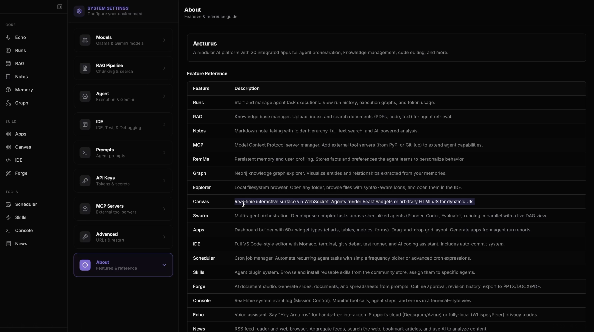
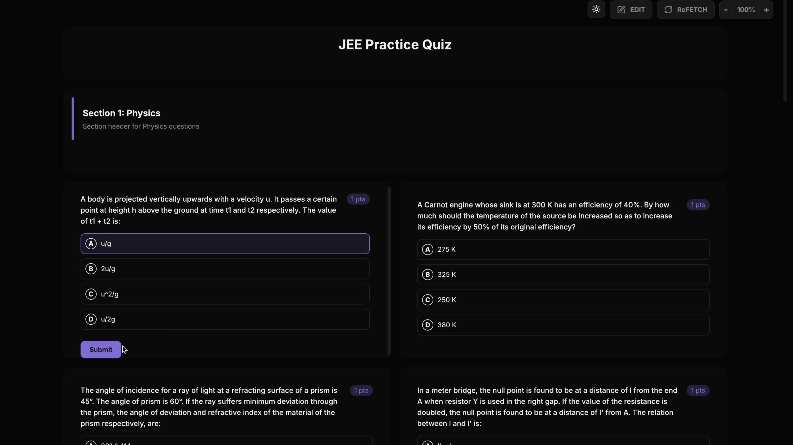
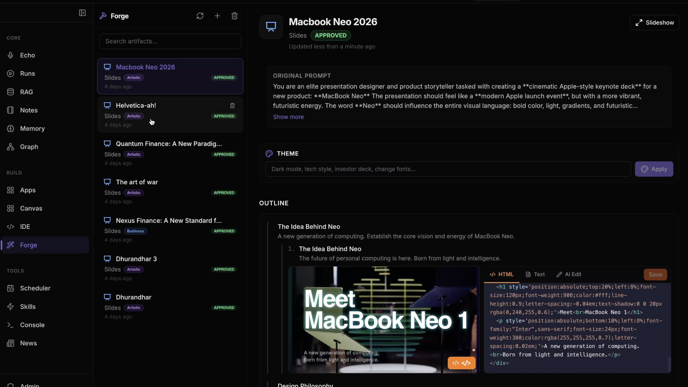
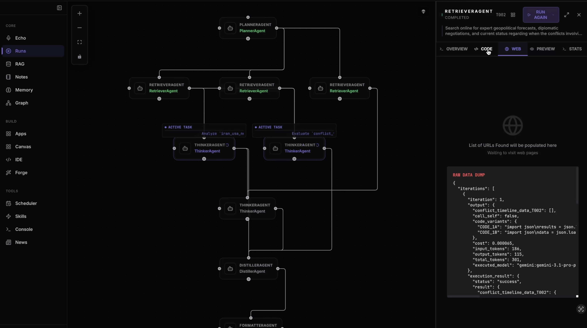
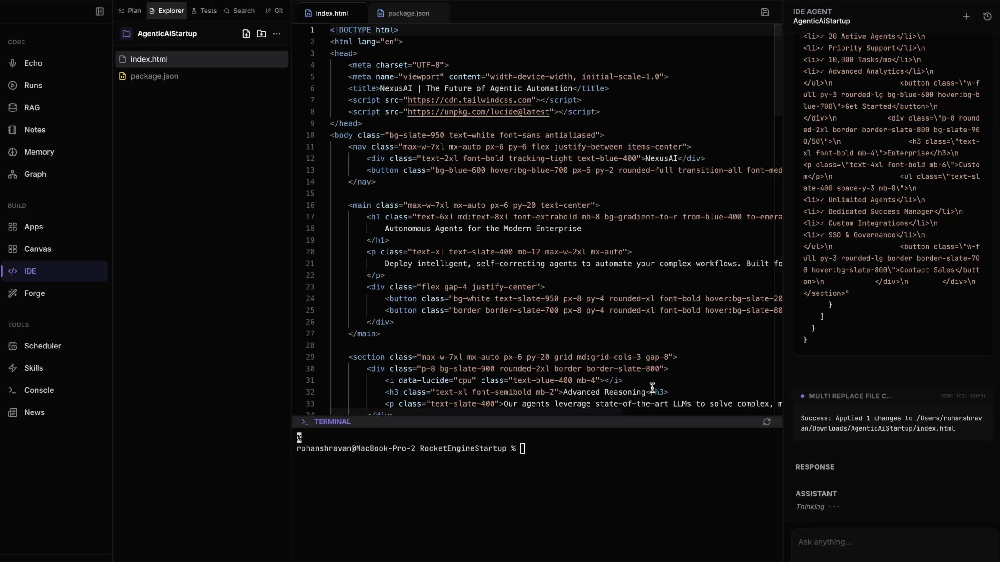
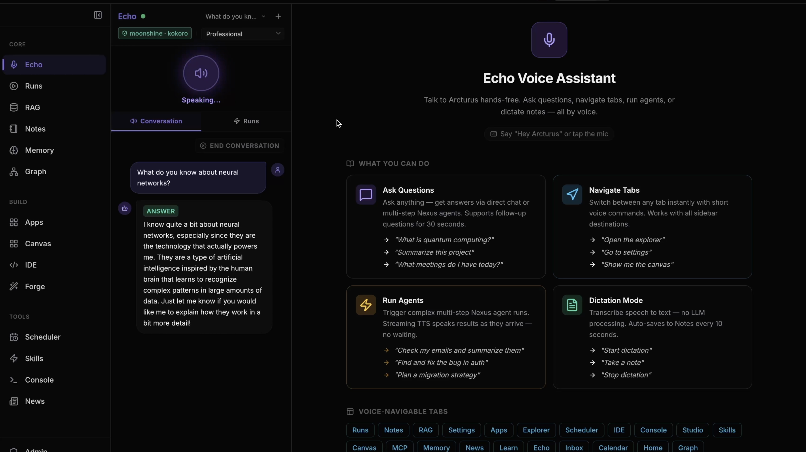
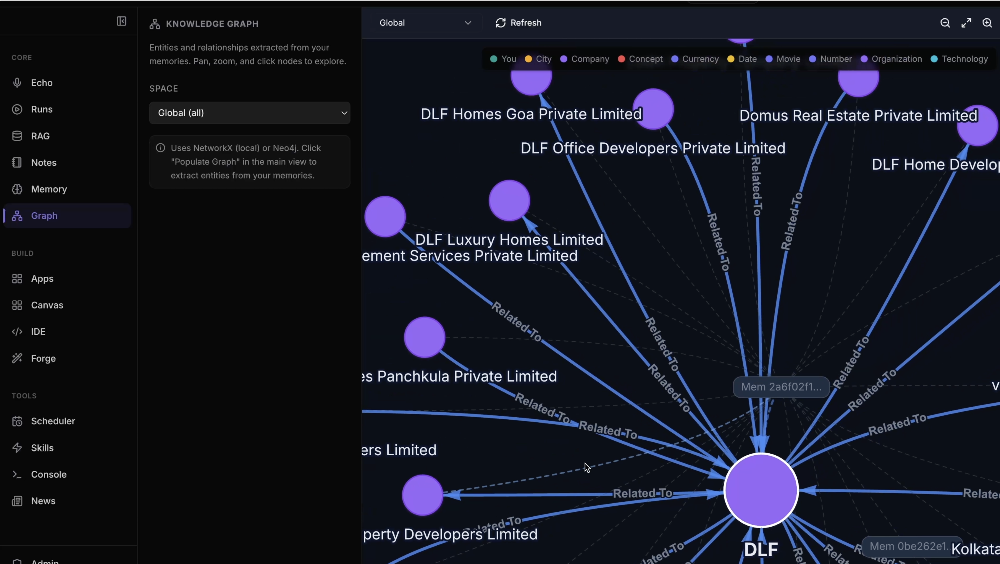
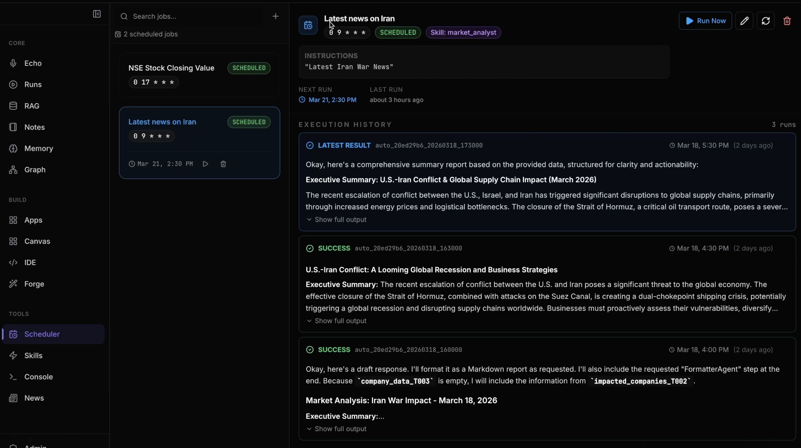

# Arcturus

Arcturus is a local-first AI workspace that brings agents, memory, documents, voice, structured workflows, and app-building into one desktop product.

It is designed for people who want more than a chat window. You can explore files, run agent workflows, build artifacts, inspect memory, browse knowledge graphs, manage skills, and operate the system from a single interface.

## Why Arcturus

We built Arcturus to help teams and students move beyond isolated AI demos and into real end-to-end application building.

That means one product where you can:

- work with agents, not just prompts
- connect memory, retrieval, workflows, and UI in the same system
- generate artifacts, apps, and reports instead of only chat responses
- inspect how the system runs through traces, health, and execution views
- operate AI features like a product team, with testing, controls, and reusable skills

## Demo

- YouTube walkthrough: [Arcturus product demo](https://youtu.be/PUfb0chxeQg)

## App Guide

| Area | What it does | Why it matters |
| --- | --- | --- |
| Echo | voice assistant for questions, commands, dictation, and spoken workflows | makes the system hands-free and accessible in real time |
| Runs | execution graph for agent tasks, intermediate outputs, and orchestration state | makes agent behavior inspectable instead of opaque |
| Forge | structured document and slide generation with preview and export flows | turns prompts into usable deliverables |
| Apps | internal app and dashboard generation inside the platform | helps users build actual tools, not just responses |
| IDE | editor, terminal, file navigation, and code-aware IDE Agent | supports end-to-end coding and implementation work |
| RAG | indexed retrieval over notes, PDFs, and project content | grounds answers in source material |
| RemMe | persistent memory, recall, and profile context | improves continuity across sessions and workflows |
| Graph | visual explorer for extracted entities and relationships | turns memory and content into navigable structure |
| Scheduler | recurring jobs, automation runs, and execution history | makes the platform useful beyond one-off interaction |
| Watchtower | diagnostics, tracing, health, and runtime controls | provides production-style observability and governance |
| Skills / Bazaar | installable capabilities and reusable packaged logic | supports extensibility and distribution |

## Screenshots

### Product Overview

Arcturus ships as a unified workspace rather than a collection of disconnected tools. The About screen gives a quick map of the major product surfaces available inside the platform.



### Apps

Apps turns Arcturus into an application builder, not just an assistant. The platform can generate and host internal dashboards, workflows, and interactive tools directly inside the product.



### Forge

Forge is the structured artifact studio. It can generate decks and documents from prompts, preserve outlines, and let you inspect and refine the generated output before export.



### Runs

Runs shows the live structure of agent execution. You can inspect orchestration graphs, active tasks, intermediate outputs, and the data each step is producing.



### IDE

The IDE workspace combines a code editor, terminal, file navigation, and an IDE Agent that can inspect code, call tools, and help execute coding workflows end to end.



### Echo

Echo is the voice-native interface for Arcturus. It supports hands-free interaction for asking questions, navigating the product, triggering agent workflows, and dictating notes.



### Knowledge Graph

The knowledge graph helps users explore relationships extracted from memory and content. It turns entity extraction into a navigable visual layer for discovery and analysis.



### Scheduler

The scheduler automates recurring jobs and makes Arcturus useful beyond one-off chats. It supports repeatable agent tasks, result history, and operational visibility.



## What Arcturus Does

Arcturus combines multiple AI product surfaces into one system:

- `IDE Agent`: read files, reason over code, call tools, and help with edits
- `Forge`: generate structured documents, slide decks, and exportable artifacts
- `RemMe`: persistent memory, entity extraction, contextual recall, and sync
- `RAG`: search and chat over PDFs, notes, and indexed content
- `Voice`: wake, transcribe, route, and respond through the voice pipeline
- `Apps`: create interactive internal tools and dashboards inside the platform
- `Watchtower`: health checks, tracing, throttling, diagnostics, and admin visibility
- `Skills / Bazaar`: installable capabilities, SDK flows, integrity checks, and marketplace-style packaging
- `Runs / Swarm`: inspect agent execution, orchestration state, and multi-agent flows

## Core Experience

Arcturus is built around a few connected workflows:

1. Bring in context
   - notes, PDFs, pages, files, memory, and external sources
2. Run an agent
   - ask for reasoning, editing, extraction, planning, or execution
3. Materialize output
   - pages, slides, graphs, dashboards, summaries, or app artifacts
4. Observe and refine
   - inspect traces, health, cost controls, memory, and rerun behavior

## Architecture

| Layer | Stack | Purpose |
| --- | --- | --- |
| Desktop UI | Electron + React + Vite + Zustand | main product interface |
| Backend API | FastAPI + Python | orchestration, routing, settings, persistence, services |
| Memory | local stores + sync + graph adapters | recall, extraction, lifecycle, visibility |
| Retrieval | RAG pipelines + vector backends | search over documents and content |
| Voice | STT + TTS + wake services | spoken interaction and command flows |
| Ops | Watchtower, tracing, diagnostics, health | production visibility and governance |
| SDK / Marketplace | Bazaar SDK and skill packaging | installable capabilities and distribution |

## Main Product Areas

| Area | What you can do |
| --- | --- |
| Explorer | browse project files and work with an IDE-style agent |
| Notes / Pages | create and view structured long-form content |
| Forge | generate slides, outlines, artifacts, and previews |
| Graph | inspect entities and relationships |
| Apps | build internal tools, dashboards, and UI surfaces |
| News / Browser | consume live content in-app |
| Settings / Admin | configure models, services, health, and runtime controls |
| Runs | inspect agent execution and flow state |
| RAG | search, ask, and browse indexed documents |

## Quick Start

### 1. Backend prerequisites

Arcturus expects Python `3.11` and uses `uv` for environment management.

```bash
uv sync --python 3.11
```

If you want the standard local data services used by the app:

```bash
docker compose up -d mongodb qdrant
```

### 2. Frontend prerequisites

```bash
cd /Users/rohanshravan/TSAI/Arcturus/platform-frontend
npm ci
```

### 3. Run the desktop app

From `/Users/rohanshravan/TSAI/Arcturus/platform-frontend`:

```bash
npm run electron:dev:all
```

This launches:

- the Electron shell
- the Vite frontend
- the local backend services the desktop app depends on

## Alternative Dev Commands

### Backend only

```bash
cd /Users/rohanshravan/TSAI/Arcturus
uv run api.py
```

### Frontend only

```bash
cd /Users/rohanshravan/TSAI/Arcturus/platform-frontend
npm run dev
```

### Frontend + backend without Electron packaging flow

```bash
cd /Users/rohanshravan/TSAI/Arcturus/platform-frontend
npm run dev:all
```

## How To Use Arcturus

### Explore and edit with the IDE Agent

- open the Explorer
- choose a project or file context
- ask the IDE Agent to inspect, explain, or modify code
- review tool calls and outputs in the conversation flow

### Build documents and presentations

- open Forge
- generate an outline, page, or deck
- preview the artifact
- export to the supported output format

### Use memory and knowledge graph features

- create or inspect memories in RemMe
- view extracted entities and relationships
- use memory-aware flows to improve continuity across sessions

### Search documents with RAG

- upload or select documents
- query the indexed content
- inspect source-backed answers and related artifacts

### Operate the system

- open admin and settings panels
- inspect health and diagnostics
- monitor runs, traces, and agent execution state

## Repository Layout

- `/Users/rohanshravan/TSAI/Arcturus/api.py` - backend app entrypoint
- `/Users/rohanshravan/TSAI/Arcturus/platform-frontend/` - Electron + React desktop client
- `/Users/rohanshravan/TSAI/Arcturus/core/` - orchestration, loops, schemas, services
- `/Users/rohanshravan/TSAI/Arcturus/routers/` - API surfaces for product features
- `/Users/rohanshravan/TSAI/Arcturus/memory/` - memory, sync, recall, and graph-related systems
- `/Users/rohanshravan/TSAI/Arcturus/voice/` - wake, STT, TTS, and orchestration
- `/Users/rohanshravan/TSAI/Arcturus/ops/` - health, diagnostics, tracing, throttling
- `/Users/rohanshravan/TSAI/Arcturus/marketplace/` - Bazaar packaging and skill flows
- `/Users/rohanshravan/TSAI/Arcturus/tests/` - unit, API, integration, acceptance, automation, and SDK tests

## Testing

Quick project check:

```bash
cd /Users/rohanshravan/TSAI/Arcturus
scripts/test_all.sh quick
```

Frontend tests:

```bash
cd /Users/rohanshravan/TSAI/Arcturus/platform-frontend
npm test
```

## Configuration

- runtime settings live in `/Users/rohanshravan/TSAI/Arcturus/config/settings.json`
- defaults live in `/Users/rohanshravan/TSAI/Arcturus/config/settings.defaults.json`
- secrets should stay in local environment variables or `.env`, not in Git

## Security Notes

- `.env` is intentionally untracked
- use `.env.example` as the template for local secrets
- do not commit API keys, tokens, voice logs, transcripts, or personal runtime data
- admin and webhook paths fail closed when required secrets are not configured

## Capstone and Delivery History

This repository also contains the capstone execution material used to build and validate the system:

- [CAPSTONE/README.md](CAPSTONE/README.md)
- [CAPSTONE/MASTER_20_DAY_PLAN.md](CAPSTONE/MASTER_20_DAY_PLAN.md)
- [CAPSTONE/project_charters/](CAPSTONE/project_charters/)

If you are trying to understand the delivered project scope, the capstone directory is the audit trail. If you are trying to run and use the product, start with the sections above.
