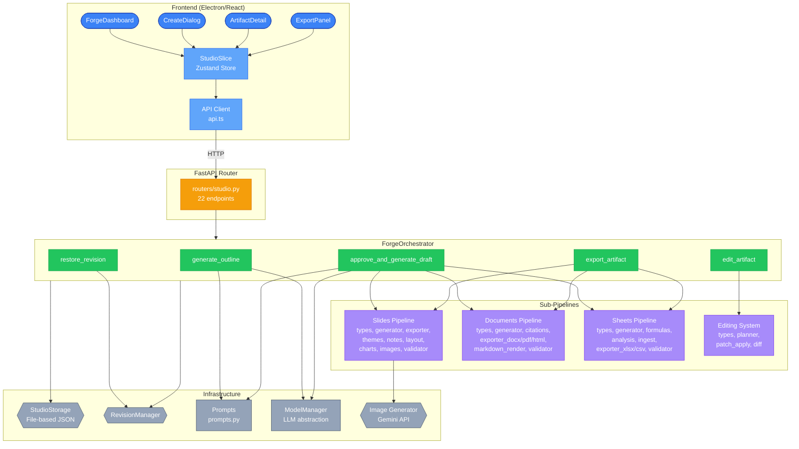
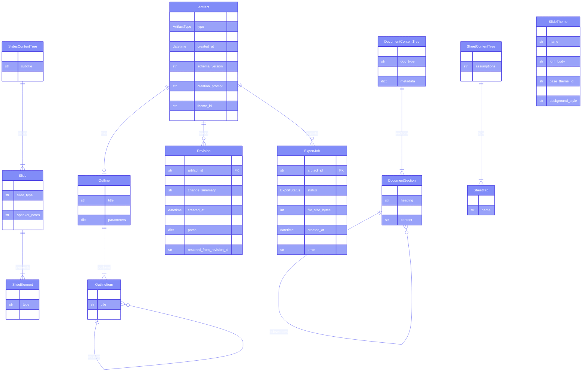
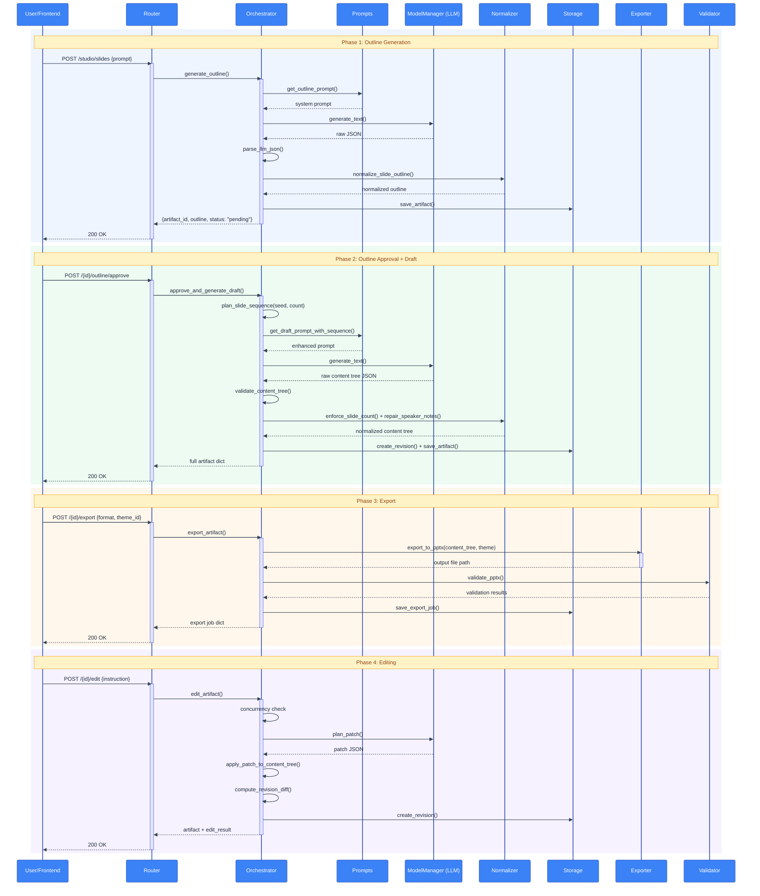
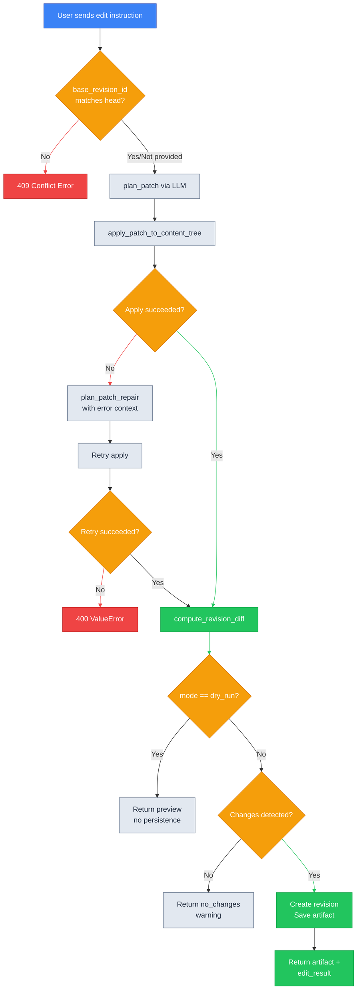

# Forge Studio — Technical Reference

AI-powered content generation platform for slides, documents, and spreadsheets.

> **Audience:** Developers working on, integrating with, or extending Forge Studio.

> **Demo Video:**
>
> [](https://youtu.be/IHKyZH_FxiA)

---

## Table of Contents

- [Overview](#overview)
  - [Current State vs Roadmap](#current-state-vs-roadmap)
- [Architecture](#architecture)
  - [System Diagram](#system-diagram)
  - [Directory Tree](#directory-tree)
  - [Data Models](#data-models)
  - [Enums Reference](#enums-reference)
  - [Deterministic vs LLM-Dependent Behavior](#deterministic-vs-llm-dependent-behavior)
- [Generation Pipeline](#generation-pipeline)
  - [Pipeline Sequence](#pipeline-sequence)
  - [Step-by-Step Walkthrough](#step-by-step-walkthrough)
- [Slides Pipeline](#slides-pipeline)
  - [Slide Types](#slide-types)
  - [Element Types](#element-types)
  - [Theme System](#theme-system)
  - [Deterministic Sequence Planning](#deterministic-sequence-planning)
  - [PPTX Exporter](#pptx-exporter)
  - [Speaker Notes](#speaker-notes)
  - [Layout Repair](#layout-repair)
  - [Charts](#charts)
  - [Image Generation](#image-generation)
  - [Validation](#validation)
- [Documents Pipeline](#documents-pipeline)
  - [Document Types](#document-types)
  - [Content Tree Normalization](#content-tree-normalization)
  - [Citations](#citations)
  - [Exporters](#exporters)
  - [Markdown Rendering](#markdown-rendering)
  - [Document Validation](#document-validation)
- [Sheets Pipeline](#sheets-pipeline)
  - [Content Tree Structure](#content-tree-structure)
  - [Normalization](#sheets-normalization)
  - [Formula Validation](#formula-validation)
  - [File Upload and Analysis](#file-upload-and-analysis)
  - [Sheet Exporters](#sheet-exporters)
  - [Visual Repair](#visual-repair)
- [Editing System](#editing-system)
  - [Edit Flow](#edit-flow)
  - [Patch Operations](#patch-operations)
  - [Target Types](#target-types)
  - [Patch Application Engine](#patch-application-engine)
  - [Diff Computation](#diff-computation)
  - [Optimistic Concurrency](#optimistic-concurrency)
- [Storage](#storage)
  - [Directory Layout](#directory-layout)
  - [StudioStorage Methods](#studiostorage-methods)
  - [RevisionManager](#revisionmanager)
  - [Runtime Side Effects](#runtime-side-effects)
- [API Reference](#api-reference)
  - [Endpoint Table](#endpoint-table)
  - [Request Models](#request-models)
  - [Error Codes](#error-codes)
  - [curl Examples](#curl-examples)
- [Frontend Integration](#frontend-integration)
  - [StudioSlice](#studioslice)
  - [Component Hierarchy](#component-hierarchy)
  - [Export Download Flow](#export-download-flow)
  - [API Client](#api-client)
- [Configuration and Constants](#configuration-and-constants)
  - [Environment Variables](#environment-variables)
  - [Constants Reference](#constants-reference)
- [Extension Guide](#extension-guide)
  - [Adding a New Slide Type](#adding-a-new-slide-type)
  - [Adding a New Theme](#adding-a-new-theme)
  - [Adding a New Document Type](#adding-a-new-document-type)
  - [Adding a New Export Format](#adding-a-new-export-format)
  - [Adding a New Patch Target Kind](#adding-a-new-patch-target-kind)
- [Testing](#testing)
  - [Test Coverage Overview](#test-coverage-overview)
  - [Test File Listing](#test-file-listing)
  - [Running Tests](#running-tests)
  - [Manual Testing](#manual-testing)
- [Known Gaps and Roadmap](#known-gaps-and-roadmap)
- [Troubleshooting](#troubleshooting)
- [Quick Reference](#quick-reference)

---

## Overview

Forge Studio is the content generation engine inside Arcturus. It turns natural-language prompts into production-ready artifacts across three formats:

- **Slides** — PowerPoint (PPTX) presentations with themes, charts, images, and speaker notes
- **Documents** — Technical specs, reports, and proposals exported as DOCX, PDF, or HTML
- **Sheets** — Spreadsheets with formulas, statistical analysis, and charts exported as XLSX or CSV

The system follows an **outline-first pipeline**: the LLM generates a structured outline, the user approves (optionally modifying it), then the LLM generates the full content tree. Deterministic post-processing — normalization, validation, layout repair — ensures consistent output quality regardless of LLM variance. After generation, artifacts can be iteratively edited through a chat-driven patch system with full revision history.

The key architectural insight is the separation of LLM-generated content (stochastic) from rendering and export (deterministic). The LLM produces a structured JSON content tree; everything downstream — PPTX shape placement, PDF rendering, formula validation — is pure Python code with no AI involvement.

### Current State vs Roadmap

The P04 charter (`CAPSTONE/project_charters/P04_forge_ai_document_slides_sheets_studio.md`) describes a broader "Google Workspace + AI" vision. The current implementation delivers a substantial core, but not the entire charter:

| Area | Implemented Today | Planned / Deferred |
|------|-------------------|-------------------|
| Artifact generation | Outline-first generation for slides, documents, and sheets | Broader product polish and feature breadth |
| Slides | 15 slide types, 16 themes + 96 variants, notes repair, layout repair, PPTX validation | Template marketplace, Google Slides export |
| Documents | Outline/draft, doc normalization, bibliography, DOCX/PDF/HTML export | Markdown, LaTeX, Google Docs export |
| Sheets | Workbook generation, formula validation, CSV/XLSX/JSON upload, analysis tabs, XLSX/CSV export | Google Sheets export, advanced spreadsheet behaviors |
| Editing | Instruction-driven patches, dry-run, optimistic concurrency, revision restore | Real-time collaborative editing, inline coauthoring UI |
| Media | Slide image caching, optional HTML hero images | Full asset marketplace, broader media pipelines |

---

## Architecture

### System Diagram



### Directory Tree

```
core/studio/                         # Main package
├── __init__.py
├── orchestrator.py                  # Central pipeline coordinator (960 lines)
├── prompts.py                       # All LLM prompt builders (462 lines)
├── storage.py                       # File-based JSON persistence (207 lines)
├── revision.py                      # Revision management (79 lines)
├── images.py                        # Shared Gemini image generation (88 lines)
│
├── slides/                          # Slides (PPTX) sub-pipeline
│   ├── __init__.py
│   ├── types.py                     # 15 slide types, 16 element types, narrative arc
│   ├── generator.py                 # Sequence planning, outline normalization
│   ├── exporter.py                  # PPTX rendering — shapes, charts, images (2312 lines)
│   ├── themes.py                    # 16 base themes + variant generation (607 lines)
│   ├── notes.py                     # Speaker notes scoring and repair
│   ├── layout.py                    # Layout density repair for exports
│   ├── charts.py                    # Chart spec parsing and inference
│   ├── images.py                    # Parallel slide image generation
│   └── validator.py                 # 5-layer PPTX validation
│
├── documents/                       # Documents (DOCX/PDF/HTML) sub-pipeline
│   ├── __init__.py
│   ├── types.py                     # 3 document types, keyword resolution
│   ├── generator.py                 # Outline and content tree normalization
│   ├── citations.py                 # Bibliography and provenance management
│   ├── exporter_docx.py            # DOCX export via python-docx
│   ├── exporter_pdf.py             # PDF export via Jinja2 + xhtml2pdf
│   ├── exporter_html.py            # HTML export with optional hero image
│   ├── markdown_render.py          # Markdown → rich text conversion
│   ├── validator.py                 # Per-format export validators
│   └── templates/                   # CSS + Jinja2 templates for PDF/HTML
│
├── sheets/                          # Sheets (XLSX/CSV) sub-pipeline
│   ├── __init__.py
│   ├── types.py                     # TabularDataset, upload constants
│   ├── generator.py                 # Content tree normalization, visual metadata
│   ├── formulas.py                  # Formula syntax, bounds, circular ref detection
│   ├── analysis.py                  # Statistical analysis pipeline
│   ├── ingest.py                    # CSV/XLSX/JSON upload parsing
│   ├── exporter_xlsx.py            # XLSX export via openpyxl
│   ├── exporter_csv.py             # CSV export as ZIP of per-tab files
│   └── validator.py                 # XLSX and CSV export validators
│
└── editing/                         # Chat-driven edit system
    ├── __init__.py
    ├── types.py                     # Patch, PatchOp, target models
    ├── planner.py                   # LLM-based patch planning
    ├── patch_apply.py              # Deterministic patch engine (503 lines)
    └── diff.py                      # Type-aware diff computation
```

### Data Models

All Pydantic models live in `core/schemas/studio_schema.py`:



### Enums Reference

| Enum | Values | Used In |
|------|--------|---------|
| `ArtifactType` | `slides`, `document`, `sheet` | Artifact.type, routing |
| `OutlineStatus` | `pending`, `approved`, `rejected` | Outline.status |
| `ExportFormat` | `pptx`, `docx`, `pdf`, `html`, `xlsx`, `csv` | ExportJob.format |
| `ExportStatus` | `pending`, `completed`, `failed` | ExportJob.status |
| `ChartType` | `bar`, `line`, `pie`, `funnel`, `scatter` | ChartSpec.chart_type |
| `AssetKind` | `image`, `chart`, `font`, `theme` | Asset.kind |
| `PatchOpType` | `SET`, `INSERT_AFTER`, `DELETE` | PatchOp.op |

### Deterministic vs LLM-Dependent Behavior

Understanding which behaviors are reproducible vs stochastic is critical for debugging and testing.

**Deterministic** (same inputs → same outputs):
- Slide count clamping and sequence planning (seeded from artifact ID via SHA-256)
- Theme variant generation (algorithmic HSL manipulation + WCAG contrast fixing)
- Formula syntax, bounds, and circular-reference validation
- File upload ingestion and statistical analysis
- Structured diff computation
- Storage layout, ordering, and path resolution
- Speaker notes scoring and layout density checks

**LLM-dependent** (output varies per call):
- Outline generation
- Content tree draft generation
- Edit patch planning and repair planning
- Optional sheet visual repair metadata

**External API-dependent**:
- Slide image generation (Gemini API)
- Optional HTML document hero image generation (Gemini API)

---

## Generation Pipeline

### Pipeline Sequence



### Step-by-Step Walkthrough

#### 1. Outline Generation (`orchestrator.py:46`)

1. Build an LLM prompt via `get_outline_prompt()` with type-specific guidance
2. Call `ModelManager.generate_text()` to get raw JSON from the LLM
3. Parse with `parse_llm_json()` (tolerant of markdown fences, trailing commas)
4. Recursively build `OutlineItem` tree from parsed data
5. Apply type-specific normalization:
   - **Slides:** `normalize_slide_outline()` — resolves slide count from params/prompt, filters structural types, trims to target count
   - **Documents:** `normalize_document_outline()` — resolves doc_type, clamps section count, inserts missing required sections
6. Create `Artifact` with `content_tree=None`, save to storage
7. Return `{artifact_id, outline, status: "pending"}`

#### 2. Outline Approval (`orchestrator.py:116`)

1. Load artifact, apply optional user modifications to outline
2. Mark outline status as `approved`
3. For slides: compute deterministic seed from artifact ID, plan slide type sequence
4. Build draft prompt (slides get `get_draft_prompt_with_sequence()`, others get `get_draft_prompt()`)
5. Call LLM to generate full content tree JSON
6. Validate against type-specific Pydantic model (`SlidesContentTree`, `DocumentContentTree`, `SheetContentTree`)
7. Apply type-specific post-processing:
   - **Slides:** `enforce_slide_count()` → `repair_speaker_notes()`
   - **Documents:** `normalize_document_content_tree()` (abstract synthesis, section ID normalization, bibliography reconciliation)
   - **Sheets:** `normalize_sheet_content_tree()` → optional `needs_sheet_visual_repair()` → second LLM pass for chart/visual metadata
8. Create initial revision, save artifact with `content_tree`
9. For slides: kick off background image generation via `asyncio.create_task()`

#### 3. Export (`orchestrator.py:256`)

1. Load artifact, validate content tree exists
2. Check artifact type / format combination is valid:
   - slides → `pptx`
   - document → `docx`, `pdf`, `html`
   - sheet → `xlsx`, `csv`
3. Resolve theme for slides (from request `theme_id` or artifact's stored `theme_id`)
4. Create `ExportJob` with status `pending`
5. For slides with `generate_images=True` or HTML documents with images: run in background via `asyncio.create_task()`
6. Execute format-specific export:
   - **PPTX:** `repair_speaker_notes()` → optional `repair_layout()` → load/generate images → `export_to_pptx()` → `validate_pptx()`
   - **DOCX:** `export_to_docx()` → `validate_docx()`
   - **PDF:** `export_to_pdf()` → `validate_pdf()`
   - **HTML:** optional hero image generation → `export_to_html()` → `validate_html()`
   - **XLSX:** `export_to_xlsx()` → `validate_xlsx()`
   - **CSV:** `export_to_csv_zip()` → `validate_csv_zip()`
7. Update export job status (`completed` or `failed` with error)

#### 4. Editing (`orchestrator.py:767`)

1. Load artifact, verify content tree exists
2. **Optimistic concurrency check:** if `base_revision_id` is provided and doesn't match `revision_head_id`, raise `ConflictError` (409)
3. Call `plan_patch()` — LLM generates a structured `Patch` JSON (target + ops)
4. Call `apply_patch_to_content_tree()`:
   - Deep copy the content tree
   - Resolve target (slide by index/id, section by id/heading, tab by name)
   - Execute ops (`SET`, `INSERT_AFTER`, `DELETE`)
   - Coerce LLM type mistakes (dict-for-string)
   - Validate against Pydantic schema
   - Apply post-patch normalization
5. On apply failure: retry once with `plan_patch_repair()` (sends error context to LLM)
6. Compute diff between old and new trees
7. In `dry_run` mode: return preview without persisting
8. If no changes detected: return with `status: "no_changes"`
9. Otherwise: create revision with diff/patch metadata, trigger image regeneration for slides

#### 5. Revision Restore (`orchestrator.py:892`)

1. Load artifact, verify content tree exists
2. Optimistic concurrency check (same as edit)
3. Early return if `target_revision_id` already equals `revision_head_id`
4. Load target revision's `content_tree_snapshot`
5. Compute diff between current and restored trees
6. Create new revision (never rewrites history — always forward-appending)
7. Set `restored_from_revision_id` on the new revision for audit trail

---

## Slides Pipeline

### Slide Types

15 supported slide types defined in `core/studio/slides/types.py`:

| Type | Allowed Elements | Typical Use |
|------|-----------------|-------------|
| `title` | title, subtitle | Opening and closing slides |
| `content` | kicker, title, body, bullet_list, takeaway | Standard narrative slides |
| `two_column` | kicker, title, body, bullet_list, takeaway | Side-by-side comparison |
| `comparison` | kicker, title, body, bullet_list, takeaway, callout_box | Pros/cons, before/after |
| `timeline` | kicker, title, body, bullet_list, takeaway | Milestones, roadmaps |
| `chart` | kicker, title, chart, body, takeaway | Data visualizations |
| `image_text` | title, image, body | Split layout with image |
| `image_full` | title, image, body | Full-bleed image with overlay |
| `quote` | quote, body | Featured quotation |
| `code` | title, code, body | Technical code display |
| `team` | title, body, bullet_list | Team members, credits |
| `stat` | kicker, title, stat_callout, body, takeaway | Key metric callouts |
| `section_divider` | title, subtitle | Section transitions (structural) |
| `agenda` | kicker, title, bullet_list | Table of contents |
| `table` | kicker, title, table_data, source_citation, takeaway | Data tables with badges |

**Structural types** (`title`, `section_divider`) are auto-generated by the sequence planner and do not count toward the user's requested `slide_count`.

### Element Types

16 supported element types:

| Type | Content Format | Purpose |
|------|---------------|---------|
| `title` | string | Slide heading |
| `subtitle` | string | Secondary heading |
| `kicker` | string | Short categorization phrase (2-5 words) |
| `takeaway` | string | Single-sentence key message (max 15 words) |
| `body` | string | Paragraph text |
| `bullet_list` | list of strings | Bulleted items |
| `image` | string (description) | Image prompt for Gemini generation |
| `chart` | dict (ChartSpec) | Structured chart data |
| `code` | string | Monospace code block |
| `quote` | string | Quotation text |
| `stat_callout` | list of dicts | Key metrics `[{value, label}]` |
| `table_data` | dict | Table with headers, rows, optional badge_column |
| `tag_badge` | string | Label badge |
| `callout_box` | dict | `{text, attribution}` insight box |
| `source_citation` | string | Source reference text |
| `progress_bar` | varies | Progress indicator |

### Theme System

The theme system (`core/studio/slides/themes.py`) provides 16 base themes plus 6 deterministic variants per base, yielding 112 total theme options.

**Base themes (16):**

| ID | Name | Font Group | Description |
|----|------|-----------|-------------|
| `corporate-blue` | Corporate Blue | formal | Enterprise presentations |
| `startup-bold` | Startup Bold | bold | Pitch decks, product launches |
| `minimal-light` | Minimal Light | modern | Clean, minimalist |
| `nature-green` | Nature Green | warm | Sustainability, environment |
| `tech-dark` | Tech Dark | bold | Dark mode for developer decks |
| `warm-terracotta` | Warm Terracotta | warm | Creative, lifestyle |
| `ocean-gradient` | Ocean Gradient | bold | Calming, ocean-inspired |
| `monochrome-pro` | Monochrome Pro | modern | High-contrast black/white |
| `finance-navy` | Finance Navy | formal | Financial reports, investor decks |
| `healthcare-teal` | Healthcare Teal | modern | Healthcare, life sciences |
| `education-purple` | Education Purple | warm | Academic, research |
| `executive-charcoal` | Executive Charcoal | formal | C-suite, board presentations |
| `creative-coral` | Creative Coral | bold | Agencies, design showcases |
| `legal-burgundy` | Legal Burgundy | formal | Legal, compliance |
| `product-indigo` | Product Indigo | modern | Product launches, roadmaps |
| `sunset-amber` | Sunset Amber | warm | Lifestyle, community |

**`SlideTheme` model fields:** `id`, `name`, `colors` (primary, secondary, accent, background, text, text_light, title_background), `font_heading`, `font_body`, `description`, `base_theme_id`, `variant_seed`, `background_style`.

**Font mood groups** map each base theme to a font compatibility group (`formal`, `modern`, `warm`, `bold`). Variants cycle through group-compatible font pairs to maintain visual coherence.

**Variant generation** (`generate_theme_variant()`) uses three strategies selected deterministically by `variant_seed % 3`:
- **hue_shift** — small hue rotation (5-12 degrees)
- **tonal** — lightness/saturation adjustment within the same hue family
- **temperature** — warm/cool shift via small hue nudge

**WCAG contrast** — every generated variant passes through `_fix_contrast()` which ensures text-on-background luminance ratio >= 4.5:1 (WCAG AA). If the generated text color fails, it iteratively adjusts lightness up to 3 times before falling back to pure black or white.

**Variant IDs** follow the pattern `{base_id}--v{NN}` (e.g., `corporate-blue--v03`). The `get_theme()` function resolves base themes directly and generates variants on demand by parsing the suffix.

### Deterministic Sequence Planning

The slide sequence planner (`core/studio/slides/generator.py`) ensures layout variety and narrative flow independently of LLM output.

**Seed computation:** `compute_seed()` derives a deterministic integer from the artifact UUID via SHA-256. This means the same artifact ID always produces the same slide sequence.

**Slide count resolution** follows a priority chain:
1. Explicit `slide_count` parameter
2. Regex parse from user prompt (e.g., "make 8 slides")
3. Default: 10

Count is clamped to `[3, 15]` range.

**Sequence planning** (`plan_slide_sequence()`):
1. Start with the `NARRATIVE_ARC` — a curated pattern of 14 slide types designed for varied visual rhythm
2. Extract content types only (filter out structural)
3. If `slide_count <= len(content_arc)`: sample that many types maintaining narrative order
4. If `slide_count > len(content_arc)`: use all types, then randomly insert from an extra pool (`content`, `two_column`, `comparison`, `timeline`, `chart`)
5. For decks with 8+ content slides: insert 1-2 section dividers at even intervals
6. Wrap with opening title + body slides + closing title
7. Post-process: prevent consecutive same-type slides, ensure at least one `image_text` slide

**`enforce_slide_count()`** runs after LLM generation to fix count mismatches:
- **With `target_count`** (initial generation): counts only non-structural slides, trims excess from the end, pads with varied filler templates
- **Without `target_count`** (patch edits): enforces `[3, 15]` range on total slide count

### PPTX Exporter

The PPTX exporter (`core/studio/slides/exporter.py`, 2312 lines) renders content trees into PowerPoint files using python-pptx with programmatic shape placement (no slide master templates).

**Design tokens** (excerpt):

| Token | Value | Purpose |
|-------|-------|---------|
| `SLIDE_WIDTH` | 13.333 in (16:9) | Widescreen slide width |
| `SLIDE_HEIGHT` | 7.5 in | Standard height |
| `title_size` | 44pt | Main title typography |
| `heading_size` | 32pt | Section headings |
| `body_size` | 18pt | Body text |
| `code_size` | 14pt | Code blocks |
| `quote_size` | 28pt | Quotation text |
| `stat_callout_size` | 56pt | Large metric callouts |
| `MARGIN_LEFT/RIGHT` | 0.75 in | Horizontal margins |
| `MARGIN_TOP` | 0.75 in | Top margin |
| `COLUMN_GAP` | 0.5 in | Two-column gap |

**Per-type render functions** handle each of the 15 slide types, placing shapes at computed positions based on the design token system. The exporter:
- Renders charts via python-pptx's chart API (bar, line, pie, scatter via XY chart, funnel via bar chart)
- Embeds generated JPEG images for `image_text` and `image_full` slides
- Applies theme colors to every shape (background fills, text colors, accent elements)
- Handles gradient backgrounds for themes with `background_style: "gradient"`
- Renders stat callouts as large-font centered text with colored accent boxes
- Renders tables with styled header rows, alternating band colors, and optional status badges
- Adds speaker notes to each slide's notes frame

### Speaker Notes

The notes quality system (`core/studio/slides/notes.py`) ensures every slide has meaningful presenter guidance.

**Quality thresholds:**

| Threshold | Body Slides | Title/Closing Slides |
|-----------|------------|---------------------|
| Min words | 15 | 8 |
| Min sentences | 2 | 1 |
| Max words | 140 | 140 |
| Copy threshold | 60% word overlap | 60% word overlap |
| Deck pass rate | 90% of slides must pass | — |

**Scoring** (`score_speaker_notes()`) checks each slide for: empty notes, too short, too long, body text copy (word overlap ratio). Returns a per-slide `passes` boolean.

**Repair** (`repair_speaker_notes()`) runs as a post-generation pass:
- **Empty notes** → inject type-specific template filler (15 different templates, one per slide type)
- **High copy** (> 60% overlap with body text) → replace with template
- **Too short** → append context sentence about the slide topic

The repair returns a new `SlidesContentTree` (immutable — never mutates input).

### Layout Repair

When `strict_layout=True` is requested during export, the layout repair system (`core/studio/slides/layout.py`) auto-fixes content density issues.

**Density thresholds:**

| Limit | Value | Scope |
|-------|-------|-------|
| `BLOCK_CHAR_LIMIT` | 800 chars | Single text block |
| `SLIDE_CHAR_LIMIT` | 1,600 chars | Total text per slide |
| `TABLE_SLIDE_CHAR_LIMIT` | 2,400 chars | Total text per table slide |
| `TITLE_CHAR_LIMIT` | 60 chars | Slide title |

**Repair process** (two-pass per slide):
1. **Element pass:** truncate body text at sentence boundary, trim bullet lists to stay under `BLOCK_CHAR_LIMIT`, strip placeholder patterns
2. **Slide pass:** if total text exceeds slide limit, find the longest trimmable element and truncate it to bring the total under the limit

Truncation always prefers sentence boundaries (`. ! ?`), falling back to word boundaries with ellipsis.

### Charts

The chart system (`core/studio/slides/charts.py`) parses, normalizes, and infers chart types from LLM-generated data.

**5 chart types:** bar, line, pie, funnel, scatter

**Auto-inference** (`infer_chart_type()`) when `chart_type` is not specified:
- Has `points` array → scatter
- Single series, all positive, ≤ 6 categories → pie
- Single series, other → bar
- Multiple series, ≤ 6 categories → bar
- Multiple series, > 6 categories → line

**Normalization** (`normalize_chart_spec()`):
- Truncate category labels to 30 chars
- Pad/trim series values to match category count
- Sort scatter points by x value

### Image Generation

Image generation uses Google's Gemini API (`core/studio/images.py` + `core/studio/slides/images.py`).

**Architecture:**
- `images.py` (shared): `generate_single_image()` — calls Gemini with a presentation-optimized prompt, returns JPEG `BytesIO`
- `slides/images.py`: `generate_slide_images()` — scans content tree for `image_text`/`image_full` slides, generates in parallel

**Concurrency:** `asyncio.Semaphore(3)` limits to ~13 RPM (under Gemini's 15 RPM limit)

**Caching:** Generated images are saved to `studio/{artifact_id}/images/{slide_id}.jpg`. On export, the orchestrator loads cached images first and only generates missing ones.

**Stale version detection:** A class-level counter (`_image_gen_version`) per artifact ID increments on each content tree update. Background generation tasks check their version before writing; if a newer version exists (e.g., user edited during generation), the stale results are discarded.

**Image prompt template:**
```
Generate a professional, clean presentation image for: {description}.
Style: modern, minimal, no text or labels or watermarks.
Composition: wide landscape, subject centered, mood and setting clearly conveyed.
```

### Validation

The 5-layer validation system (`core/studio/slides/validator.py`) checks exported PPTX files:

| Layer | Type | What It Checks |
|-------|------|----------------|
| 1. Structural | Blocking | File opens, slide count matches expected |
| 2. Layout | Blocking | Text block density (800 char/block, 1600 char/slide), shape bounds within slide dimensions, font size ≥ 10pt |
| 3. Chart quality | Advisory | Chart slides contain chart shapes or `[Chart:]` markers |
| 4. Notes quality | Advisory | ≥ 90% of slides pass notes scoring, no empty notes |
| 5. Content heuristics | Mixed | Title length (≤ 60 chars, advisory), bullet count (≤ 7, advisory), placeholder text detection (blocking), sparse content (< 20 chars, advisory) |

**Quality score** calculation (0-100):
- Start at 100
- Layout errors: -40
- Layout warnings: -5 each (max -20)
- Notes quality fail: -20
- Chart quality fail: -20

The `valid` field is `True` only when layer 1 (structural) has zero errors. Layout errors are checked but reported separately in `layout_errors`.

---

## Documents Pipeline

### Document Types

Three document types defined in `core/studio/documents/types.py`:

| Type | Label | Required Sections | Optional Sections | Section Range |
|------|-------|-------------------|-------------------|---------------|
| `technical_spec` | Technical Specification | Introduction, Requirements, Architecture, Implementation | Glossary, Appendix, References, Testing Strategy | 4-15 |
| `report` | Report | Executive Summary, Introduction, Findings, Conclusion | Methodology, Recommendations, Appendix, References | 4-20 |
| `proposal` | Proposal | Executive Summary, Problem Statement, Proposed Solution, Timeline | Budget, Risk Assessment, Team, References | 4-15 |

**Auto-detection** from prompt text uses a keyword map (e.g., "tech spec" → `technical_spec`, "rfp" → `proposal`). Falls back to `report`.

### Content Tree Normalization

Document normalization (`core/studio/documents/generator.py`) handles the gap between raw LLM output and the expected schema.

**Raw normalization** (`normalize_document_content_tree_raw()`) — runs before Pydantic validation:
- Maps field aliases: `title` → `doc_title`, `type` → `doc_type`, `children` → `subsections`, `name` → `heading`
- Ensures required fields exist with defaults
- Recursively normalizes section dicts (coerces `id` to str, `level` to int)
- Normalizes unknown `doc_type` values to `report`

**Post-validation normalization** (`normalize_document_content_tree()`):
- **Abstract synthesis:** If abstract is missing, takes first 200 chars of first non-empty section content
- **Section ID normalization:** Assigns sequential IDs (`sec1`, `sec1_1`, `sec1_2`, etc.)
- **Level clamping:** Enforces max depth of 3 levels; subsections beyond depth 3 are flattened
- **Placeholder stripping:** Removes TBD, TODO, Lorem ipsum, etc. from section content
- **Bibliography normalization:** Deduplicates by key, ensures required fields (key, title, author)
- **Citation reconciliation:** Adds placeholder entries for orphan citation keys (referenced in content but missing from bibliography)
- **Provenance slots:** Builds `metadata.provenance_slots` from bibliography entries

### Citations

The citation system (`core/studio/documents/citations.py`) manages references between content and bibliography.

**Inline extraction:** Regex `\[([a-zA-Z0-9_-]+)\]` finds citation keys in section content (e.g., `[smith2024]`).

**`extract_citation_keys_from_sections()`:** Recursively walks the section tree, collecting keys from both explicit `citations` lists and inline `[key]` patterns in content.

**`reconcile_citations_and_bibliography()`:** Compares used keys against bibliography entries. For each orphan key (used but not in bibliography), adds a placeholder entry:
```python
{"key": key, "title": f"[{key}]", "author": "Unknown"}
```

**`build_provenance_slots()`:** Generates placeholder provenance metadata for each bibliography entry:
```python
{"citation_key": key, "source_type": "reference", "verified": False}
```

### Exporters

**DOCX** (`documents/exporter_docx.py`):
- Uses `python-docx` to create structured Word documents
- Renders section headings at appropriate levels (Heading 1-3)
- Processes markdown in section content via `markdown_render.py`
- Includes bibliography as a formatted references section

**PDF** (`documents/exporter_pdf.py`):
- Uses Jinja2 templates to generate HTML
- Renders HTML to PDF via `xhtml2pdf`
- CSS styling from `documents/templates/`

**HTML** (`documents/exporter_html.py`):
- Uses Jinja2 templates with CSS styling
- Optional hero image (generated via Gemini when `generate_images=True`)
- Image is base64-encoded and embedded inline

### Markdown Rendering

The markdown renderer (`documents/markdown_render.py`) converts markdown syntax in section content to rich text for DOCX export:
- Code blocks (fenced with triple backticks)
- Tables (pipe-delimited)
- Inline formatting (bold, italic, code spans)

### Document Validation

Per-format validators in `documents/validator.py`:

| Format | Checks |
|--------|--------|
| DOCX | File opens with python-docx, has paragraphs, paragraph count > 0 |
| PDF | File opens with xhtml2pdf, page count > 0 |
| HTML | File exists, contains `<html>` and `</html>`, no `<script>` tags (injection guard) |

---

## Sheets Pipeline

### Content Tree Structure

`SheetContentTree` contains:
- `workbook_title` — display name
- `tabs` — list of `SheetTab`, each with:
  - `id`, `name` — unique identifiers
  - `headers` — column names
  - `rows` — 2D array of values (strings, numbers, null)
  - `formulas` — dict mapping cell addresses (e.g., `"C2"`) to Excel formulas (e.g., `"=B2*1.1"`)
  - `column_widths` — per-column width in pixels
- `assumptions` — optional text describing model assumptions
- `metadata` — visual profile, palette hint, chart plan
- `analysis_report` — `SheetAnalysisReport` with summary stats, correlations, trends, anomalies, pivot preview

### Normalization

Sheet normalization (`core/studio/sheets/generator.py`) ensures structural integrity:

1. **ID dedup:** Appends `_2`, `_3` suffixes for duplicate tab IDs
2. **Name dedup:** Appends `(2)`, `(3)` for duplicate tab names
3. **Row width alignment:** Pads short rows with `None`, truncates excess columns to match header count
4. **Column width normalization:** Pads/trims `column_widths` to match header count (default: 100px)
5. **Placeholder sanitization:** Replaces TBD, TODO, Lorem ipsum, N/A, Placeholder, xxx, … with `—`
6. **Formula validation:** Validates syntax, bounds, and circular references (see below)
7. **Visual metadata normalization:** Validates `visual_profile` (must be `balanced`, `conservative`, or `max`), sanitizes `chart_plan` entries

### Formula Validation

The formula system (`core/studio/sheets/formulas.py`) provides multi-layer validation:

**Syntax validation** (`validate_formula_syntax()`):
- Must start with `=`
- Balanced parentheses

**Cell reference extraction** (`extract_cell_refs()`):
- Regex `(?<![A-Z])[A-Z]{1,3}[0-9]+(?![0-9(])` matches cell references while excluding function names (e.g., `LOG10`)
- Handles range endpoints (A1:B10 → both A1 and B10)

**Bounds checking** (`validate_formula_refs()`):
- All referenced cells must be within the tab's data range
- Formula keys (the cells containing the formula) may extend one row/column beyond bounds (for totals rows/columns)

**Circular reference detection** (`detect_circular_refs()`):
- Builds a directed dependency graph: formula cell → referenced formula cells
- Uses DFS with three-color marking (WHITE/GRAY/BLACK) to find all cells on cycles
- Only formula cells participate — data cells cannot create cycles
- Returns sorted list of cells that are members of cycles (not just cells that lead into cycles)

**`validate_tab_formulas()`:** Orchestrates all checks. Invalid formulas are removed from `tab.formulas` and warnings are recorded. Circular references are detected and removed last, after syntax and bounds checks.

### File Upload and Analysis

**Ingestion** (`core/studio/sheets/ingest.py`):

Supports three file formats: CSV, XLSX, JSON.

| Guard | Limit |
|-------|-------|
| File size | 10 MB (`MAX_UPLOAD_SIZE_BYTES`) |
| Row count | 20,000 (`MAX_UPLOAD_ROWS`) |
| Column count | 200 (`MAX_UPLOAD_COLUMNS`) |

- CSV: Auto-detects delimiter via `csv.Sniffer` (comma, semicolon, tab, pipe)
- XLSX: Opens first sheet via `openpyxl` with `data_only=True`
- JSON: Accepts list-of-objects `[{col: val}]` or `{columns, rows}` shape
- All formats coerce numeric strings to `int`/`float`

**Analysis** (`core/studio/sheets/analysis.py`):

The `analyze_dataset()` function runs deterministic statistical analysis:

| Analysis | Method | Output |
|----------|--------|--------|
| Summary statistics | Per-column: count, null_count, mean, median, std, min, max | `SheetNumericSummary` list |
| Correlations | Pairwise Pearson R for numeric columns (min 5 observations) | `SheetCorrelation` list |
| Trends | Linear regression slope → classified as `up`/`down`/`flat` (epsilon: 1e-6) | `SheetTrend` list |
| Anomalies | Z-score based (threshold: 3.0) | `SheetAnomaly` list |
| Pivot preview | First categorical × first numeric column, grouped mean | `Dict` |

**`build_analysis_tabs()`** converts results into `SheetTab` instances:
- `Uploaded_Data` — raw data
- `Summary_Stats` — if numeric columns exist
- `Correlations` — if pairs found
- `Anomalies` — if z-score outliers detected
- `Pivot` — if categorical/numeric pair found

### Sheet Exporters

**XLSX** (`sheets/exporter_xlsx.py`):
- Uses `openpyxl` to create multi-tab workbooks
- Writes headers, data rows, and formulas
- Applies `SheetPalette` styling (header colors, alternating row bands)
- Renders embedded charts from `metadata.chart_plan`
- Sanitizes sheet names (Excel's 31-char limit, forbidden characters)

**CSV** (`sheets/exporter_csv.py`):
- Exports as a ZIP file containing one CSV per tab
- Tab names are sanitized for filesystem safety
- Formula cells are excluded (CSV has no formula support)

### Visual Repair

The visual repair system uses a two-pass approach for enriching sheet visual metadata:

1. **`needs_sheet_visual_repair()`** checks if the content tree has chartable numeric data but is missing visual metadata (no valid `visual_profile`, no `palette_hint`, or empty `chart_plan`)
2. If repair is needed, `get_sheet_visual_repair_prompt()` builds a focused LLM prompt asking only for visual metadata (not data changes)
3. **`merge_sheet_visual_metadata()`** merges the LLM response into the content tree, validating each field:
   - `visual_profile` must be one of: `balanced`, `conservative`, `max`
   - `palette_hint` must be a non-empty string
   - `chart_plan` entries must have valid `chart_type` (bar, line, pie, scatter)

---

## Editing System

### Edit Flow



### Patch Operations

Three operation types defined in `core/studio/editing/types.py`:

| Operation | Description | Required Fields |
|-----------|-------------|-----------------|
| `SET` | Replace a value at a path | `path`, `value` |
| `INSERT_AFTER` | Append an item to a list at a path | `path`, `item`, optional `id_key` for idempotency |
| `DELETE` | Remove the value at a path | `path` |

**Path format:** Dot-notation with numeric indices, relative to the resolved target.
- `"title"` — the title field
- `"elements[0].content"` — first element's content
- `"rows[0][1]"` — first row, second cell (chained indices)

JSONPath filter expressions (`[?(@.id == "e7")]`) are explicitly rejected — use target `kind: "slide_element"` with `element_id` instead.

### Target Types

Each artifact type has specific target kinds:

**Slides:**

| Kind | Required Fields | Resolves To |
|------|----------------|-------------|
| `deck` | — | Top-level tree (deck_title, subtitle, metadata) |
| `slide_index` | `index` (1-based) | Specific slide dict |
| `slide_id` | `id` | Slide with matching id |
| `slide_element` | `element_id` | Element dict within any slide |

**Documents:**

| Kind | Required Fields | Resolves To |
|------|----------------|-------------|
| `section_id` | `id` | Section with matching id (recursive search) |
| `heading_contains` | `text` | First section whose heading contains the text |

**Sheets:**

| Kind | Required Fields | Resolves To |
|------|----------------|-------------|
| `tab_name` | `name` | Tab with matching name |
| `cell_range` | `tab_name`, `a1` | Tab for cell-level operations |

On target resolution failure, error messages include the list of available targets for easier debugging.

### Patch Application Engine

`apply_patch_to_content_tree()` (`core/studio/editing/patch_apply.py:434`) is the main entry point:

1. **Deep copy** — `copy.deepcopy(content_tree_dict)` ensures the original is never mutated
2. **Target resolution** — `_resolve_target()` navigates to the anchor node
3. **Op execution** — each op is applied in order; warnings are collected for no-ops
4. **LLM value coercion** — `_coerce_llm_value_types()` fixes common LLM mistakes:
   - Dict-for-string: `{"text": "actual value", "text_color": "blue"}` → `"actual value"` (checks keys `text`, `value`, `content`)
   - Only applies to element types with string content (title, subtitle, body, etc. — not chart or table_data)
5. **Pydantic validation** — validates the patched tree against the type-specific model
6. **Post-patch normalization** — applies type-specific cleanup:
   - Slides: `enforce_slide_count()` + `repair_speaker_notes()`
   - Documents: `normalize_document_content_tree()`
   - Sheets: `normalize_sheet_content_tree()`

### Diff Computation

`compute_revision_diff()` (`core/studio/editing/diff.py`) produces structured diffs:

**Output structure:**
```json
{
  "stats": {"paths_changed": 5, "slides_changed": 2, "sections_changed": 0, "tabs_changed": 0},
  "highlights": [
    {"kind": "slide", "slide_index": 3, "change": "Updated title + content"}
  ],
  "paths": [
    {"path": "slides[2].title", "before": "Old Title", "after": "New Title"}
  ]
}
```

**Algorithm:** Recursive tree walk comparing `before` and `after` dicts/lists. Collects changed leaf paths up to `max_paths=50`. Long string values are truncated to 100 chars in the diff output.

**Type-aware grouping:** Changed paths are grouped by container type:
- Slides: extracts 0-based slide index, describes changes as "Updated title + content + notes"
- Documents: extracts section ID
- Sheets: extracts tab name

**`summarize_diff_highlights()`** generates a human-readable summary string from highlights (e.g., `"Slide 3: Updated title + content; Slide 7: Updated notes"`).

### Optimistic Concurrency

The `ConflictError` mechanism prevents lost updates when multiple clients edit the same artifact:

1. Frontend sends `base_revision_id` (the revision ID it currently has)
2. Orchestrator compares it to `artifact.revision_head_id`
3. If they differ, raises `ConflictError` → router returns **409 Conflict**
4. Frontend must reload the artifact and re-apply the edit against the new head

This applies to both `edit_artifact()` and `restore_revision()`.

---

## Storage

### Directory Layout

```
studio/                                 # Base directory (configurable via FORGE_STUDIO_DIR)
└── {artifact_id}/                      # UUID-named artifact directory
    ├── artifact.json                   # Artifact model (id, type, title, outline, content_tree, etc.)
    ├── revisions/
    │   ├── {revision_id_1}.json        # Full content_tree_snapshot + metadata
    │   └── {revision_id_2}.json
    ├── exports/
    │   ├── {export_job_id}.json        # Export job metadata (status, validator_results)
    │   └── {export_job_id}.pptx        # Exported file (pptx, docx, pdf, html, xlsx, zip)
    └── images/
        ├── {slide_id_1}.jpg            # Cached slide preview images
        └── {slide_id_2}.jpg
```

### StudioStorage Methods

`StudioStorage` (`core/studio/storage.py`) provides file-based JSON persistence:

| Method | Description |
|--------|-------------|
| `save_artifact(artifact)` | Serialize to `{id}/artifact.json` |
| `load_artifact(artifact_id)` | Load and deserialize, returns `None` if not found |
| `list_artifacts()` | List all artifacts sorted by `updated_at` desc |
| `delete_artifact(artifact_id)` | Delete entire artifact directory (`shutil.rmtree`) |
| `save_revision(revision)` | Save to `{artifact_id}/revisions/{revision_id}.json` |
| `load_revision(artifact_id, revision_id)` | Load specific revision |
| `list_revisions(artifact_id)` | List revision summaries sorted by `created_at` desc |
| `save_export_job(export_job)` | Save to `{artifact_id}/exports/{job_id}.json` |
| `load_export_job(artifact_id, export_job_id)` | Load specific export job |
| `list_export_jobs(artifact_id)` | List export job summaries sorted by `created_at` desc |
| `get_export_file_path(artifact_id, job_id, fmt)` | Return path for exported file |
| `find_export_job(export_job_id)` | Scan all artifacts for an export job by ID |
| `save_slide_image(artifact_id, slide_id, bytes)` | Save JPEG to `images/{slide_id}.jpg` |
| `load_slide_image_path(artifact_id, slide_id)` | Return path or `None` |
| `list_slide_images(artifact_id)` | List slide IDs with cached images |

**Base directory priority:** explicit constructor arg > `FORGE_STUDIO_DIR` env var > `PROJECT_ROOT/studio`

**Security:** Slide image operations validate `slide_id` against `^[\w-]+$` regex. Export downloads validate paths are within the expected base directory (path traversal guard).

### RevisionManager

`RevisionManager` (`core/studio/revision.py`) wraps storage with revision lifecycle logic:

| Method | Description |
|--------|-------------|
| `create_revision(...)` | Create and persist a new revision with UUID, timestamp, and optional edit metadata |
| `get_revision(artifact_id, revision_id)` | Load a specific revision |
| `get_revision_history(artifact_id)` | List all revisions in reverse chronological order |

`compute_change_summary()` compares two content tree dicts and reports: `"N added, N removed, N changed"` at the top-level key level. Returns `"Initial draft"` if old tree is `None`.

### Runtime Side Effects

Key behaviors to be aware of during development and debugging:

- **Image invalidation on edit:** Editing or restoring a slides artifact deletes the `images/` directory and schedules regeneration. The `_image_gen_version` counter ensures stale background tasks don't overwrite newer content.
- **Background exports:** Slides export with `generate_images=True` and HTML document export with `generate_images=True` return immediately and finish in the background. Poll the export job for completion.
- **Export job lifecycle:** Jobs are created as `pending` before work begins, then updated to `completed` or `failed`. A crash between creation and completion leaves an orphaned `pending` job.
- **Revision append-only:** Restoring a revision never rewrites history — it creates a new forward revision with `restored_from_revision_id` set for audit trail.

---

## API Reference

### Endpoint Table

All endpoints are under the `/api/studio` prefix (router prefix `/studio` + app-level `/api`).

| Method | Path | Description | Request Body | Success |
|--------|------|-------------|-------------|---------|
| `POST` | `/studio/slides` | Create slides artifact with outline | `CreateArtifactRequest` | `{artifact_id, outline, status}` |
| `POST` | `/studio/documents` | Create document artifact with outline | `CreateArtifactRequest` | `{artifact_id, outline, status}` |
| `POST` | `/studio/sheets` | Create sheet artifact with outline | `CreateArtifactRequest` | `{artifact_id, outline, status}` |
| `POST` | `/studio/{id}/outline/approve` | Approve/reject outline → generate draft | `ApproveOutlineRequest` | Full artifact dict |
| `POST` | `/studio/{id}/edit` | Chat-driven edit | `EditArtifactRequest` | Artifact + `edit_result` |
| `GET` | `/studio/themes` | List available themes | Query: `include_variants`, `base_id`, `limit` | `SlideTheme[]` |
| `GET` | `/studio/{id}/images` | List cached slide image IDs | — | `{slide_ids: string[]}` |
| `GET` | `/studio/{id}/images/{slide_id}` | Serve cached slide image | — | JPEG file |
| `POST` | `/studio/{id}/generate-images` | Trigger image generation | — | `{status: "generating"}` |
| `GET` | `/studio/exports/{job_id}` | Get export job by ID (global) | — | `ExportJob` |
| `GET` | `/studio/{id}` | Get full artifact | — | `Artifact` |
| `GET` | `/studio` | List all artifacts | — | `[{id, type, title, updated_at}]` |
| `DELETE` | `/studio` | Delete all artifacts | — | `{deleted: N}` |
| `DELETE` | `/studio/{id}` | Delete single artifact | — | 204 No Content |
| `GET` | `/studio/{id}/revisions` | List revisions | — | `[{id, change_summary, created_at}]` |
| `GET` | `/studio/{id}/revisions/{rev_id}` | Get specific revision | — | `Revision` |
| `POST` | `/studio/{id}/revisions/{rev_id}/restore` | Restore to revision | `RestoreRevisionRequest` | Artifact + `restore_result` |
| `POST` | `/studio/{id}/export` | Export artifact | `ExportArtifactRequest` | `ExportJob` |
| `POST` | `/studio/{id}/sheets/analyze-upload` | Upload file for analysis | `multipart/form-data` (file) | Full artifact dict |
| `GET` | `/studio/{id}/exports` | List export jobs | — | `[{id, format, status, ...}]` |
| `GET` | `/studio/{id}/exports/{job_id}` | Get export job status | — | `ExportJob` |
| `GET` | `/studio/{id}/exports/{job_id}/download` | Download exported file | — | File response |

### Request Models

**`CreateArtifactRequest`:**

| Field | Type | Required | Description |
|-------|------|----------|-------------|
| `prompt` | `str` | Yes | Natural language description of the artifact |
| `title` | `str` | No | Override the LLM-generated title |
| `parameters` | `dict` | No | Type-specific params (e.g., `{"slide_count": 8}`, `{"doc_type": "technical_spec"}`) |
| `model` | `str` | No | Override default LLM model |

**`ApproveOutlineRequest`:**

| Field | Type | Default | Description |
|-------|------|---------|-------------|
| `approved` | `bool` | `True` | `True` to approve and generate draft, `False` to reject |
| `modifications` | `dict` | `None` | Optional: `{"title": "New Title", "items": [...]}` |

**`EditArtifactRequest`:**

| Field | Type | Default | Description |
|-------|------|---------|-------------|
| `instruction` | `str` | — | User's edit instruction (required, non-empty) |
| `base_revision_id` | `str` | `None` | For optimistic concurrency |
| `mode` | `"apply" \| "dry_run"` | `"apply"` | Preview without persisting |

**`ExportArtifactRequest`:**

| Field | Type | Default | Description |
|-------|------|---------|-------------|
| `format` | `str` | `"pptx"` | Target format |
| `theme_id` | `str` | `None` | Theme for slides exports |
| `strict_layout` | `bool` | `False` | Auto-fix layout density (slides only) |
| `generate_images` | `bool` | `False` | Generate AI images (slides PPTX, HTML documents) |

**`RestoreRevisionRequest`:**

| Field | Type | Default | Description |
|-------|------|---------|-------------|
| `base_revision_id` | `str` | `None` | For optimistic concurrency |

### Error Codes

| Code | Condition | Example |
|------|-----------|---------|
| 400 | Validation failure, bad request | Invalid format, empty instruction, unsupported combo |
| 404 | Resource not found | Artifact, revision, export job not found |
| 409 | Concurrency conflict | `base_revision_id` doesn't match current head |
| 422 | Pydantic validation error | Invalid request body shape |
| 500 | Internal server error | LLM failure, export crash |

### curl Examples

**Workflow 1: Create Slides → Approve Outline → Export PPTX**

```bash
# Step 1: Create slides artifact
curl -X POST http://localhost:8000/api/studio/slides \
  -H "Content-Type: application/json" \
  -d '{
    "prompt": "Create a pitch deck for an AI-powered code review tool",
    "title": "CodeReview AI Pitch",
    "parameters": {"slide_count": 10}
  }'
# Returns: {"artifact_id": "<uuid>", "outline": {...}, "status": "pending"}

# Step 2: Approve outline and generate draft
curl -X POST http://localhost:8000/api/studio/<artifact_id>/outline/approve \
  -H "Content-Type: application/json" \
  -d '{"approved": true}'
# Returns: full artifact dict with content_tree

# Step 3: Export to PPTX with a theme
curl -X POST http://localhost:8000/api/studio/<artifact_id>/export \
  -H "Content-Type: application/json" \
  -d '{
    "format": "pptx",
    "theme_id": "tech-dark",
    "strict_layout": true,
    "generate_images": true
  }'
# Returns: {"id": "<job_id>", "status": "pending", ...}

# Step 4: Poll for completion (if generate_images=true)
curl http://localhost:8000/api/studio/<artifact_id>/exports/<job_id>
# Returns: {"status": "completed", "output_uri": "...", ...}

# Step 5: Download the file
curl -O http://localhost:8000/api/studio/<artifact_id>/exports/<job_id>/download
```

**Workflow 2: Create Document → Edit → Export PDF**

```bash
# Step 1: Create document
curl -X POST http://localhost:8000/api/studio/documents \
  -H "Content-Type: application/json" \
  -d '{
    "prompt": "Write a technical specification for a real-time chat system with WebSocket support",
    "parameters": {"doc_type": "technical_spec"}
  }'

# Step 2: Approve outline
curl -X POST http://localhost:8000/api/studio/<artifact_id>/outline/approve \
  -H "Content-Type: application/json" \
  -d '{"approved": true}'

# Step 3: Edit via chat
curl -X POST http://localhost:8000/api/studio/<artifact_id>/edit \
  -H "Content-Type: application/json" \
  -d '{
    "instruction": "Add a section about message encryption using AES-256",
    "mode": "apply"
  }'
# Returns: artifact + edit_result with revision_id, diff, warnings

# Step 4: Export to PDF
curl -X POST http://localhost:8000/api/studio/<artifact_id>/export \
  -H "Content-Type: application/json" \
  -d '{"format": "pdf"}'
```

**Workflow 3: Create Sheet → Upload File → Export XLSX**

```bash
# Step 1: Create sheet
curl -X POST http://localhost:8000/api/studio/sheets \
  -H "Content-Type: application/json" \
  -d '{
    "prompt": "Create a quarterly sales tracking spreadsheet with revenue projections"
  }'

# Step 2: Approve outline
curl -X POST http://localhost:8000/api/studio/<artifact_id>/outline/approve \
  -H "Content-Type: application/json" \
  -d '{"approved": true}'

# Step 3: Upload a CSV for analysis
curl -X POST http://localhost:8000/api/studio/<artifact_id>/sheets/analyze-upload \
  -F "file=@sales_data.csv"
# Returns: artifact with analysis tabs (Summary_Stats, Correlations, Anomalies, Pivot)

# Step 4: Export to XLSX
curl -X POST http://localhost:8000/api/studio/<artifact_id>/export \
  -H "Content-Type: application/json" \
  -d '{"format": "xlsx"}'
```

---

## Frontend Integration

### StudioSlice

The `StudioSlice` interface in `platform-frontend/src/store/index.ts` manages all Forge Studio frontend state:

**State fields:**

| Field | Type | Description |
|-------|------|-------------|
| `studioArtifacts` | `any[]` | List of artifact summaries |
| `activeArtifactId` | `string \| null` | Currently selected artifact |
| `activeArtifact` | `any \| null` | Full artifact data |
| `isGenerating` | `boolean` | Outline generation in progress |
| `isApproving` | `boolean` | Draft generation in progress |
| `isStudioModalOpen` | `boolean` | Create dialog visibility |
| `studioThemes` | `any[]` | Cached theme list |
| `isExporting` | `boolean` | Export in progress |
| `exportJobs` | `any[]` | Export job list for active artifact |
| `activeExportJobId` | `string \| null` | Currently polling export job |
| `exportPollingInterval` | `ReturnType<typeof setInterval> \| null` | Polling timer |
| `autoDownloadJobId` | `{jobId, artifactId} \| null` | Auto-download trigger |
| `editLoading` | `boolean` | Edit in progress |
| `editError` | `string \| null` | Last edit error |
| `editConflict` | `boolean` | Concurrency conflict detected |
| `approveError` | `string \| null` | Last approve error |

**Key actions:**

| Action | Description |
|--------|-------------|
| `fetchArtifacts()` | Load artifact list from API |
| `loadArtifact(id)` | Load full artifact detail |
| `createArtifact(type, prompt, title?)` | Create new artifact, load it after creation |
| `approveOutline(id)` | Approve and generate draft |
| `rejectOutline(id)` | Reject outline |
| `fetchThemes(params?)` | Load themes (cached after first fetch) |
| `startExport(artifactId, format?, themeId?, ...)` | Start export, begin polling |
| `pollExportJob(artifactId, jobId)` | Poll until completed/failed |
| `deleteArtifact(id)` | Delete and remove from local state |
| `clearAllArtifacts()` | Delete all artifacts |
| `analyzeSheetUpload(artifactId, file)` | Upload file for sheet analysis |
| `applyEditInstruction(artifactId, instruction, baseRevisionId?)` | Apply chat edit |
| `clearEditState()` | Reset edit loading/error/conflict flags |

### Component Hierarchy

```
ForgeDashboard
├── CreateDialog (type selector, prompt input)
├── ArtifactList (summary cards with status badges)
└── ArtifactDetail
    ├── OutlineViewer (tree view of outline items, approve/reject buttons)
    ├── ContentTreeViewer (rendered preview of content)
    ├── ExportPanel (theme picker, format selector, export button, download)
    ├── EditPanel (instruction input, apply/dry-run, diff viewer)
    └── RevisionsPanel (revision history, restore button)
```

### Export Download Flow

**Electron path** (desktop app):
1. Frontend triggers export via `startExport()`
2. Polls `getExportJob()` until `status: "completed"`
3. Gets download URL via `getExportDownloadUrl()`
4. Invokes Electron IPC: `window.electronAPI.invoke('download-file', {url, filename})`
5. Main process shows native Save dialog → writes to user-selected path → auto-opens file

**Browser path** (dev mode):
1. Same polling flow
2. Creates `<a>` element with `href=downloadUrl`, `download=filename`
3. Triggers click to start blob download

### API Client

The API client (`platform-frontend/src/lib/api.ts`) exposes these Studio methods:

| Method | Endpoint | Purpose |
|--------|----------|---------|
| `listArtifacts()` | `GET /studio` | Fetch all artifacts |
| `getArtifact(id)` | `GET /studio/{id}` | Fetch full artifact |
| `createArtifact(type, payload)` | `POST /studio/{type}` | Create with prompt |
| `approveOutline(id, approved, modifications?)` | `POST /studio/{id}/outline/approve` | Approve/reject |
| `listRevisions(id)` | `GET /studio/{id}/revisions` | Get revision history |
| `getRevision(artifactId, revisionId)` | `GET /studio/{id}/revisions/{rev}` | Get specific revision |
| `restoreRevision(artifactId, revisionId, base?)` | `POST /studio/{id}/revisions/{rev}/restore` | Restore revision |
| `listThemes(params?)` | `GET /studio/themes` | Get themes |
| `exportArtifact(id, format, themeId?, ...)` | `POST /studio/{id}/export` | Start export |
| `listExportJobs(id)` | `GET /studio/{id}/exports` | List exports |
| `getExportJob(artifactId, jobId)` | `GET /studio/{id}/exports/{job}` | Get export status |
| `getExportJobGlobal(jobId)` | `GET /studio/exports/{job}` | Get by job ID only |
| `getExportDownloadUrl(artifactId, jobId)` | — (URL builder) | Build download URL |
| `listSlideImages(artifactId)` | `GET /studio/{id}/images` | List cached images |
| `getSlideImageUrl(artifactId, slideId)` | — (URL builder) | Build image URL |
| `generateSlideImages(artifactId)` | `POST /studio/{id}/generate-images` | Trigger generation |
| `deleteArtifact(id)` | `DELETE /studio/{id}` | Delete artifact |
| `clearAllArtifacts()` | `DELETE /studio` | Delete all |
| `editArtifact(artifactId, payload)` | `POST /studio/{id}/edit` | Apply edit |
| `analyzeSheetUpload(artifactId, file)` | `POST /studio/{id}/sheets/analyze-upload` | Upload for analysis |

---

## Configuration and Constants

### Environment Variables

| Variable | Required | Default | Description |
|----------|----------|---------|-------------|
| `GEMINI_API_KEY` | Yes | — | Google Gemini API key for LLM calls and image generation |
| `FORGE_STUDIO_DIR` | No | `PROJECT_ROOT/studio` | Override storage directory path |

### Constants Reference

**Slides — Sequence Planning** (`slides/generator.py`):

| Constant | Value | Description |
|----------|-------|-------------|
| `MIN_SLIDES` | 3 | Minimum content slide count |
| `MAX_SLIDES` | 15 | Maximum content slide count |
| `DEFAULT_SLIDES` | 10 | Default when no count specified |

**Slides — Speaker Notes** (`slides/notes.py`):

| Constant | Value | Description |
|----------|-------|-------------|
| `_MIN_WORDS` | 15 | Min words for body slides |
| `_MIN_WORDS_TITLE` | 8 | Min words for title/closing |
| `_MAX_WORDS` | 140 | Max words for any slide |
| `_MIN_SENTENCES` | 2 | Min sentences for body slides |
| `_MIN_SENTENCES_TITLE` | 1 | Min sentences for title/closing |
| `_COPY_THRESHOLD` | 0.60 | Max word overlap with body text |
| `_DECK_PASS_RATE` | 0.90 | Min pass rate for validation |

**Slides — Layout** (`slides/layout.py`):

| Constant | Value | Description |
|----------|-------|-------------|
| `BLOCK_CHAR_LIMIT` | 800 | Max chars per text block |
| `SLIDE_CHAR_LIMIT` | 1,600 | Max chars per slide |
| `TABLE_SLIDE_CHAR_LIMIT` | 2,400 | Max chars per table slide |
| `TITLE_CHAR_LIMIT` | 60 | Max chars per slide title |

**Slides — Exporter** (`slides/exporter.py`):

| Constant | Value | Description |
|----------|-------|-------------|
| `SLIDE_WIDTH` | 13.333 in | 16:9 widescreen width |
| `SLIDE_HEIGHT` | 7.5 in | Standard height |
| `MARGIN_LEFT` / `MARGIN_RIGHT` | 0.75 in | Horizontal margins |
| `MARGIN_TOP` | 0.75 in | Top margin |
| `MARGIN_BOTTOM` | 0.5 in | Bottom margin |

**Slides — Images** (`slides/images.py`):

| Constant | Value | Description |
|----------|-------|-------------|
| `_SEMAPHORE_LIMIT` | 3 | Max concurrent image API calls |

**Slides — Themes** (`slides/themes.py`):

| Constant | Value | Description |
|----------|-------|-------------|
| `_VARIANTS_PER_BASE` | 6 | Variants generated per base theme |
| `DEFAULT_THEME_ID` | `"corporate-blue"` | Fallback theme |

**Documents** (`documents/generator.py`):

| Constant | Value | Description |
|----------|-------|-------------|
| `MAX_DEPTH` | 3 | Maximum section nesting depth |

**Sheets — Upload** (`sheets/types.py`):

| Constant | Value | Description |
|----------|-------|-------------|
| `MAX_UPLOAD_SIZE_BYTES` | 10,485,760 (10 MB) | Maximum upload file size |
| `MAX_UPLOAD_ROWS` | 20,000 | Maximum rows in uploaded data |
| `MAX_UPLOAD_COLUMNS` | 200 | Maximum columns in uploaded data |

**Sheets — Analysis** (`sheets/types.py`):

| Constant | Value | Description |
|----------|-------|-------------|
| `ANOMALY_Z_THRESHOLD` | 3.0 | Z-score threshold for anomaly detection |
| `TREND_EPSILON` | 1e-6 | Slope threshold for flat trend classification |
| `MIN_OBSERVATIONS_FOR_CORRELATION` | 5 | Minimum observations for Pearson R |

**Editing — Diff** (`editing/diff.py`):

| Constant | Value | Description |
|----------|-------|-------------|
| `max_paths` (default) | 50 | Maximum changed paths collected |

---

## Extension Guide

### Adding a New Slide Type

1. **Register the type** in `core/studio/slides/types.py`:
   - Add to `SLIDE_TYPES` set
   - Add element mapping in `SLIDE_TYPE_ELEMENTS`
   - Optionally add to `NARRATIVE_ARC` for automatic sequence inclusion

2. **Add render function** in `core/studio/slides/exporter.py`:
   - Create `_render_{type}_slide(prs, slide, theme)` function
   - Register in the slide type dispatch dict
   - Use design tokens for positioning

3. **Update prompts** in `core/studio/prompts.py`:
   - Add the new type to the outline guidance text
   - Add content format rules to the draft schema text

4. **Add speaker notes template** in `core/studio/slides/notes.py`:
   - Add entry to `_TEMPLATES` dict

5. **Write tests** in `tests/test_studio_slides_exporter.py`:
   - Add fixture with the new slide type
   - Verify PPTX renders correctly

### Adding a New Theme

1. **Register** in `core/studio/slides/themes.py`:
   ```python
   _register(SlideTheme(
       id="my-theme",
       name="My Theme",
       colors=SlideThemeColors(
           primary="#...", secondary="#...", accent="#...",
           background="#...", text="#...", text_light="#...",
           title_background="#...",
       ),
       font_heading="Calibri",
       font_body="Corbel",
       description="Description of the theme",
   ))
   ```

2. **Add font group mapping** in `_THEME_FONT_GROUP`:
   ```python
   "my-theme": "modern",  # or formal, warm, bold
   ```

3. Variants are auto-generated — no additional work needed.

### Adding a New Document Type

1. **Add template** in `core/studio/documents/types.py`:
   ```python
   DOC_TYPE_TEMPLATES["my_type"] = {
       "label": "My Document Type",
       "required_sections": ["Introduction", "Conclusion"],
       "optional_sections": ["Appendix"],
       "min_sections": 2,
       "max_sections": 15,
   }
   ```

2. **Add keywords** to `_KEYWORD_MAP` for auto-detection

3. **Update prompts** in `core/studio/prompts.py`:
   - Add the new type to outline guidance and draft schema

### Adding a New Export Format

1. **Add enum value** to `ExportFormat` in `core/schemas/studio_schema.py`

2. **Update valid combinations** in `orchestrator.py:290` (`_VALID_COMBOS`)

3. **Create exporter module** (e.g., `documents/exporter_rtf.py`):
   - Implement `export_to_rtf(content_tree, output_path)` function

4. **Create validator** in the appropriate `validator.py`:
   - Implement `validate_rtf(output_path, content_tree)` returning `{"valid": bool, "errors": []}`

5. **Wire into orchestrator** — add `elif` branch in the appropriate `_run_*_export()` method

6. **Add media type** in `routers/studio.py` (`_EXPORT_MEDIA_TYPES` dict)

### Adding a New Patch Target Kind

1. **Add Pydantic model** in `core/studio/editing/types.py`:
   ```python
   class MyTarget(BaseModel):
       kind: Literal["my_target"]
       field: str
   ```
   Update the `Target` union type.

2. **Add resolver** in `core/studio/editing/patch_apply.py`:
   - Add `elif kind == "my_target":` branch in `_resolve_target()`
   - Return the subtree node that ops should apply to

3. **Update prompt docs** in `core/studio/prompts.py`:
   - Add the new target kind to the edit prompt's target kinds section

---

## Testing

### Test Coverage Overview

The Forge Studio test suite contains **35 test files** with approximately **10,873 lines** of test code, organized by module.

### Test File Listing

**Schema & Core:**
- `tests/test_studio_schema.py` (574 lines) — Pydantic model validation
- `tests/test_studio_orchestrator.py` (1,088 lines) — Pipeline integration
- `tests/test_studio_storage.py` (174 lines) — File persistence
- `tests/test_studio_revision.py` (160 lines) — Revision management
- `tests/test_studio_router.py` (57 lines) — FastAPI routing
- `tests/test_studio_export_router.py` (494 lines) — Export endpoint tests

**Slides:**
- `tests/test_studio_slides_types.py` (87 lines) — Type constants
- `tests/test_studio_slides_generator.py` (323 lines) — Sequence planning
- `tests/test_studio_slides_exporter.py` (1,273 lines) — PPTX rendering
- `tests/test_studio_slides_themes.py` (145 lines) — Theme catalog
- `tests/test_studio_slides_theme_variants.py` (138 lines) — Variant generation
- `tests/test_studio_slides_notes.py` (104 lines) — Speaker notes
- `tests/test_studio_slides_layout.py` (150 lines) — Layout repair
- `tests/test_studio_slides_charts.py` (130 lines) — Chart parsing
- `tests/test_studio_slides_validator.py` (253 lines) — PPTX validation

**Documents:**
- `tests/test_studio_documents_types.py` (90 lines) — Type registry
- `tests/test_studio_documents_generator.py` (339 lines) — Normalization
- `tests/test_studio_documents_exporter_docx.py` (388 lines) — DOCX export
- `tests/test_studio_documents_exporter_pdf.py` (254 lines) — PDF export
- `tests/test_studio_documents_markdown_render.py` (190 lines) — Markdown
- `tests/test_studio_documents_validator.py` (150 lines) — Validators

**Sheets:**
- `tests/test_studio_sheets_generator.py` (181 lines) — Normalization
- `tests/test_studio_sheets_formulas.py` (265 lines) — Formula validation
- `tests/test_studio_sheets_analysis.py` (203 lines) — Analysis pipeline
- `tests/test_studio_sheets_ingest.py` (120 lines) — File ingestion
- `tests/test_studio_sheets_exporter_xlsx.py` (423 lines) — XLSX export
- `tests/test_studio_sheets_exporter_csv.py` (240 lines) — CSV export
- `tests/test_studio_sheets_validator.py` (268 lines) — Export validators

**Editing:**
- `tests/test_studio_editing_types.py` (92 lines) — Patch models
- `tests/test_studio_editing_patch_apply.py` (357 lines) — Patch engine
- `tests/test_studio_editing_diff.py` (153 lines) — Diff computation
- `tests/test_studio_editing_planner.py` (234 lines) — LLM planner

**Acceptance & Integration:**
- `tests/acceptance/p04_forge/test_exports_open_and_render.py` (960 lines) — Full pipeline
- `tests/integration/test_forge_research_to_slides.py` (816 lines) — End-to-end

### Running Tests

```bash
# All studio tests (baseline — no external dependencies)
PYTHONPATH=. uv run python -m pytest -q tests/test_studio_*.py

# Specific subsystem
PYTHONPATH=. uv run python -m pytest -q tests/test_studio_slides_*.py      # Slides
PYTHONPATH=. uv run python -m pytest -q tests/test_studio_documents_*.py   # Documents
PYTHONPATH=. uv run python -m pytest -q tests/test_studio_sheets_*.py      # Sheets
PYTHONPATH=. uv run python -m pytest -q tests/test_studio_editing_*.py     # Editing

# Acceptance tests (requires LLM keys)
PYTHONPATH=. uv run python -m pytest -q tests/acceptance/p04_forge/

# Integration tests
PYTHONPATH=. uv run python -m pytest -q tests/integration/test_forge_research_to_slides.py -m integration

# Full test suite (backend + frontend)
scripts/test_all.sh quick
```

### Manual Testing

```bash
# Manual pipeline test (generates artifacts without HTTP)
PYTHONPATH=. uv run python scripts/manual_test_forge.py

# Generate sample PPTX decks across all themes
PYTHONPATH=. uv run python scripts/generate_sample_decks.py
```

---

## Known Gaps and Roadmap

The following are charter capabilities not yet fully implemented. These are roadmap items, not shipped behavior.

### Charter capabilities not yet implemented

- Workspace-style collaboration and inline coauthoring
- Google Slides, Google Docs, and Google Sheets export/integration
- Document export to Markdown and LaTeX
- Template marketplace and template sharing/discovery
- Richer frontend WYSIWYG editing across all artifact types
- Broader product-level sharing/publishing workflows

### Implemented but narrower than the charter suggests

- Document types are normalized to `technical_spec`, `report`, and `proposal` only — the schema comment lists a wider set
- Slides export supports PPTX only, not the charter's wider export set
- Sheet upload analysis is a focused statistical pipeline (summary stats, correlations, trends, anomalies), not a full spreadsheet assistant
- Image generation is a supporting export/preview feature, not a broad media studio

### Practical reading of the subsystem today

The best way to think about current Forge Studio:

- A solid backend artifact pipeline with typed schemas and file-backed persistence
- A shared lifecycle for create, approve, edit, restore, export, and inspect
- Strong format-specific export and validation already in place
- An architecture that can grow toward the charter, but has not yet reached the full product vision

---

## Troubleshooting

| Problem | Cause | Solution |
|---------|-------|----------|
| **"Artifact has no content tree"** | Outline not yet approved | Call `POST /{id}/outline/approve` with `{"approved": true}` before export or edit |
| **409 Conflict on edit** | Another edit completed while you were editing | Reload artifact to get latest `revision_head_id`, re-apply edit with updated `base_revision_id` |
| **Image generation fails silently** | Missing `GEMINI_API_KEY` or API rate limit | Check logs for warnings; verify key is set in `.env`; reduce concurrent requests |
| **Export validation fails** | Content density too high; placeholder text detected | Enable `strict_layout: true` to auto-repair; check content tree for TBD/placeholder patterns |
| **Formulas removed from sheet** | Invalid syntax, out-of-bounds refs, or circular references | Check `analysis_report.warnings` on the artifact; formulas must use valid A1 notation and stay within tab bounds |
| **PPTX font rendering differs** | System missing specified fonts | Install Office-compatible fonts (Calibri, Cambria, etc.) or use themes with system-available fonts |
| **Sheet upload rejected** | File exceeds limits | Check: size < 10 MB, rows < 20,000, columns < 200; supported formats: CSV, XLSX, JSON |
| **Edit patch fails twice** | LLM generating invalid patches | Check error message; verify content tree structure matches expected schema; try simpler edit instruction |

---

## Quick Reference

If you are new to Forge Studio, start here:

1. **Read the data models** — `core/schemas/studio_schema.py`: understand the persisted shapes (Artifact, Outline, Revision, content trees)
2. **Read the orchestrator** — `core/studio/orchestrator.py`: understand lifecycle behavior (generate, approve, export, edit, restore)
3. **Read the API surface** — `routers/studio.py`: see the public HTTP contract and request/response models
4. **Read your artifact type's package** — `core/studio/slides/`, `documents/`, or `sheets/`: understand format-specific behavior
5. **Run the tests** — use the test files listed in [Testing](#testing) to confirm behavior before changing assumptions
